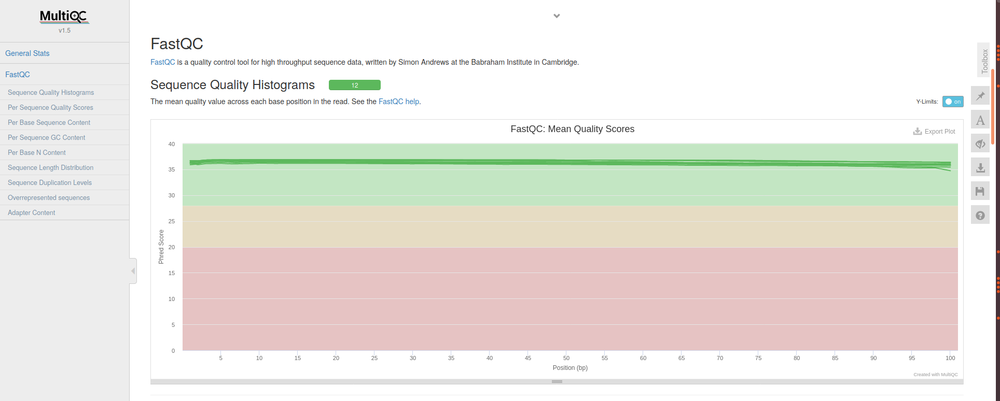
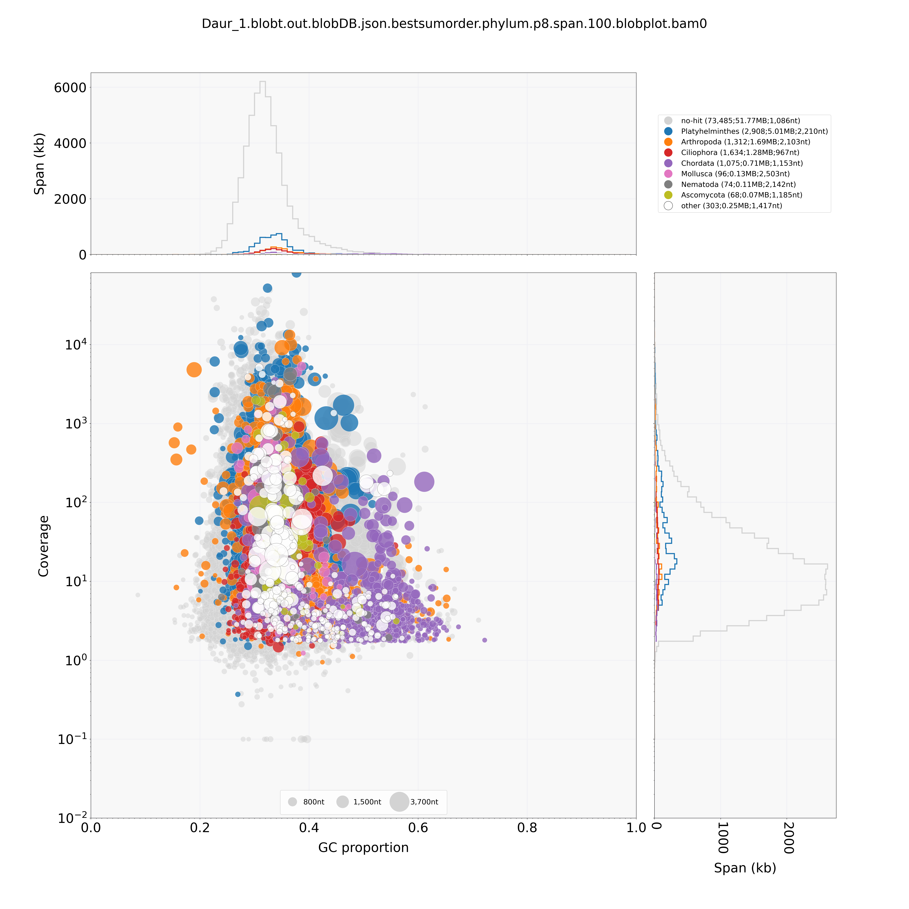
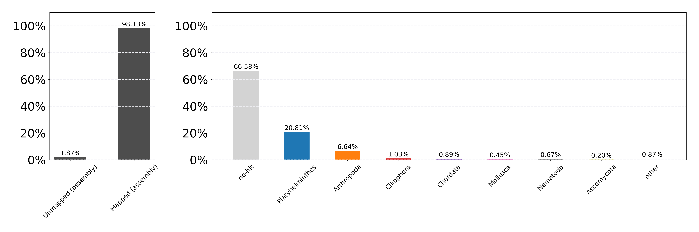
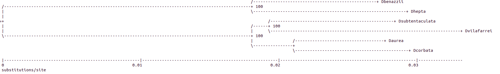
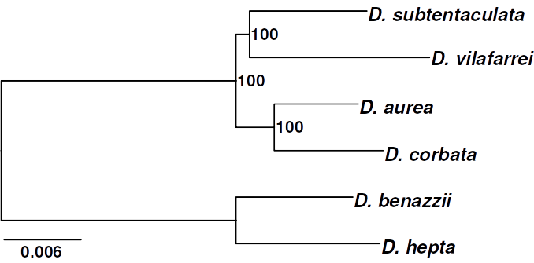
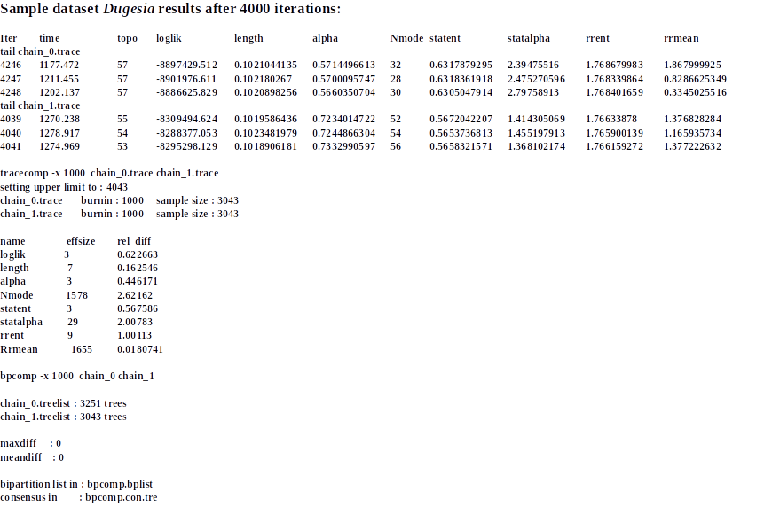
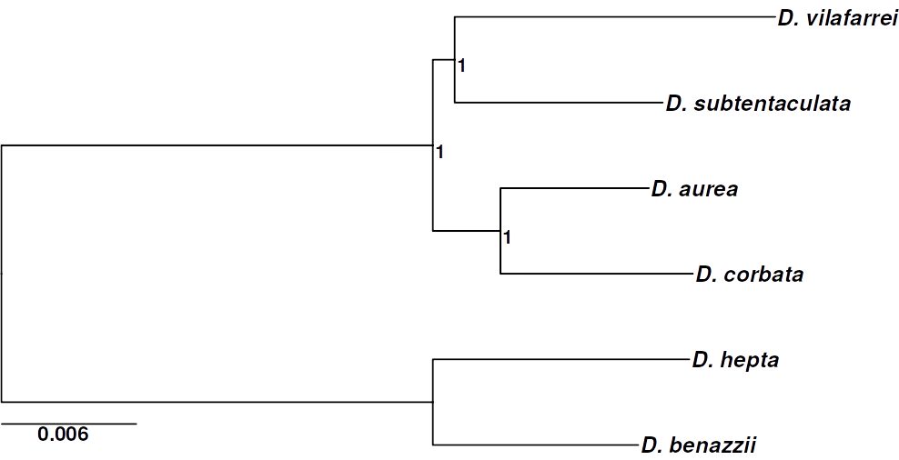
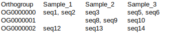

**TRANSCRIPTOME PHYLOGENY WORKFLOW**

**Reconstructing phylogenies with transcriptomic data from non-model organisms. A case study with freshwater planarians.**

This workflow has been tested and ran in the computational cluster of the [Evolutionary Genomics & Bioinformatics](http://www.ub.edu/molevol/EGB/) research group lidered by Julio Rozas from University of Barcelona. To ensure a successful workflow run you need access to powerful computational assets. It is highly advisable to have available a large number of parallelized cores as well as plenty of RAM memory to optimize computational processes that otherwise would drag on forever. The presented scripts are designed to send the job to a queueing system. Having a basic set of skills regarding the use of the terminal and Unix-like systems will ease your experience as a user when confronting this workflow. You can consult a basic introductory course of linux for biologists from the Korf lab [here](http://korflab.ucdavis.edu/unix_and_perl/).

**FIRST STEPS!!**

**Installing conda**

First and foremost, I recommend you to Install [conda](https://anaconda.org/) in your cluster of use. Conda is an open-source, cross-platform, package manager and environment management system. You can follow a step-by-step guide on how to install it [here](https://docs.conda.io/projects/conda/en/latest/user-guide/install/).

We will be using conda to access and install the necessary packages. I recommend creating new environments to install the software (be sure to check the [conda's manual](https://conda.io/projects/conda/en/latest/user-guide/tasks/manage-environments.html#activating-an-environment)). In some cases, it might be necessary since some software will need specific requirements to be met in order to function properly (or at all).

**Getting the data**

You can work directly with your own data or use the **supplied raw data** of six species of freshwater planarians belong to *Dugesia* genus to test the workflow.

The supplied raw data has been generated with Illumina technology and the TruSeqRNA library. Since are paired-end reads, every sample has two files: samplename_1.fastq.gz (reads 1 or forward) and samplename_2.fastq.gz (reads 2 or reverse). The data is available at the NCBI-SRA repository under the BioProject accession code: [PRJNA797284](https://dataview.ncbi.nlm.nih.gov/object/31675193) and following SRA codes:

*Dugesia aurea* [SRR17642743](https://dataview.ncbi.nlm.nih.gov/object/SRR17642743)<br/>
Daur_1\_1.fastq.gz<br/>
Daur_1\_2.fastq.gz<br/>

*D. benazzii* [SRR17642753](https://dataview.ncbi.nlm.nih.gov/object/SRR17642753)<br/>
DbenSard_6\_1.fastq.gz<br/>
DbenSard_6\_2.fastq.gz<br/>

*D. corbata* [SRR17642750](https://dataview.ncbi.nlm.nih.gov/object/SRR17642750)<br/>
Dcorb_1\_1.fastq.gz<br/>
Dcorb_1\_2.fastq.gz<br/>

*D. hepta* [SRR17642736](https://dataview.ncbi.nlm.nih.gov/object/SRR17642736)<br/>
Dhept_1\_1.fastq.gz<br/>
Dhept_1\_2.fastq.gz<br/>

*D. subtentaculata* [SRR17642690](https://dataview.ncbi.nlm.nih.gov/object/SRR17642690)<br/>
DsubMch_1\_1.fastq.gz<br/>
DsubMch_1\_2.fastq.gz<br/>

*D. vilafarrei* [SRR17642676](https://dataview.ncbi.nlm.nih.gov/object/SRR17642676)<br/>
Dvila_1\_1.fastq.gz<br/>
Dvila_1\_2.fastq.gz<br/>

# I. Quality control

After downloading the data the first step must be to explore its quality.

## I.1 QC stats using [FastQC](https://github.com/s-andrews/FastQC) with default parameters and [MultiQC](https://multiqc.info/docs/#running-multiqc) to generate a single report for all samples

Install the software:

```{bash}
conda install -c bioconda fastqc
conda install -c bioconda -c conda-forge multiqc
```

Use bash scripts to submit the jobs to the cluster. I provide all the scripts that you will need and you can download them from this page. If you want to generate your own scripts, you can use *nano* as command line text editor.

To submit the jobs to the cluster, I had included some lines with hashtags (donated by: Silvia Hinojosa) in all scripts with some options of qsub command.

>\#\$ -cwd<br/>
>\#\$ -j y<br/>
>\#\$ -V \#export environment var<br/>
>\#\$ -N fastqc \#name Job<br/>
>\#\$ -m ea \#add email<br/>
>echo "\*\*\*\*\*\*\*\*\*\*\*\*\*\*\*\*\*\*\*\*\*\*\*\*\*\*\*\*\*\*\*\*\*\*\*\*\*\*\*\*\*\*\*\*\*\*\*\*\*\*\*\*\*\*\*\*\*\*\*\*\*\*\*\*\*\*"<br/>
>echo "\*\*\*\*\*\*\*\*\*" \$HOSTNAME " \*\*\*\*\*\* JOB_ID=" \$JOB_ID " \*\*\*\*\*\*\*\*\*\*\*\*\*"<br/>
>echo "\*\*\*\*\*\*\*\*\*\*\*\*\*\*\*\*\*\*\*\*\*\*\*\*\*\*\*\*\*\*\*\*\*\*\*\*\*\*\*\*\*\*\*\*\*\*\*\*\*\*\*\*\*\*\*\*\*\*\*\*\*\*\*\*\*\*"<br/>

```{bash}

##script_name: FastQC.sh

##Put all the fasta files in the same folder and run from this directory

#!/bin/bash
#$ -cwd
#$ -j y
#$ -V                    #export environment var
#$ -N fastqc             #name Job
#$ -m ea                 #add email
echo "***************************************************************"
echo "*********" $HOSTNAME " ****** JOB_ID=" $JOB_ID "  *************"
echo "***************************************************************"

# conda activate

mkdir FASTQC_results

for FILE in  *.gz
do
  echo "********************" $FILE "***************************"
  echo "*********************************************************"
  fastqc $FILE -o FASTQC_results/
done

# Run multiqc to obtain the single report of all samples
cd FASTQC_results/
multiqc .

```

By running this script you will obtain a HTML file for every sample and a single report for all samples "multiqc_report.html". Be sure to always go over it. This html file summarize the results of all \*fastq.gz files:



## I.2 Trimming sequences using [Trimmomatic](https://github.com/timflutre/trimmomatic)

```{bash}
conda create --name trimmo
conda activate trimmo
conda install -c bioconda trimmomatic
```

```{bash}
##script_name: Trimmomatic.sh

##Put reads1 and reads2 in the same folder and run from said directory.
# The files have to have the following structure in the names:
# samplename_1.fastq.gz reads 1
# samplename_2.fastq.gz reads 2

#!/bin/sh
#$ -cwd
#$ -j y
#$ -V                    #export environment var
#$ -N Trimm             #name Job
#$ -m ea                 #add email
echo "***************************************************************"
echo "*********" $HOSTNAME " ****** JOB_ID=" $JOB_ID "  *************"
echo "***************************************************************"

## conda activate trimmo

THREADS=$1
ADAPTERS=$2 ## PATH to ADAPTERS

for f1 in *_1.fastq.gz
do
    f2=${f1%%_1.fastq.gz}"_2.fastq.gz"
   trimmomatic PE -threads $THREADS -phred33 -trimlog $f1.log $f1 $f2  $f1.trimP.fq.gz $f1.trimUP.fq.gz $f2.trimP.fq.gz $f2.trimUP.fq.gz ILLUMINACLIP:$ADAPTERS:2:30:10:1:keepBothReads LEADING:3 TRAILING:3 SLIDINGWINDOW:4:15 MINLEN:36

done

```

If you have the Unique Dual index used for every sample, you can use the following script. However, you will have to generate an independent ILLUMINACLIMP file for every sample.

```{bash}

##script_name: Trimmomatic_uniq_index.sh

##Put reads1, reads2, and illuminaclimp files in the same folder and run from said directory. 
# The files have to have the following structure in the names:
# samplename_1.fastq.gz reads 1
# samplename_2.fastq.gz reads 2
# samplename_TruSeq_adap_ind.fa illuminaclimp file

#!/bin/sh
#$ -cwd
#$ -j y
#$ -V                    #export environment var
#$ -N Trimm             #name Job
#$ -m ea                 #add email
echo "***************************************************************"
echo "*********" $HOSTNAME " ****** JOB_ID=" $JOB_ID "  *************"
echo "***************************************************************"

## conda activate trimmo

for f1 in *_1.fastq.gz
do
    f2=${f1%%_1.fastq.gz}"_2.fastq.gz"
    f3=${f1%%_1.fastq.gz}"_TruSeq_adap_ind.fa"
   trimmomatic PE -threads 8 -phred33 -trimlog $f1.log $f1 $f2  $f1.trimP.fq.gz $f1.trimUP.fq.gz $f2.trimP.fq.gz $f2.trimUP.fq.gz ILLUMINACLIP:$f3:2:30:10:1:keepBothReads LEADING:3 TRAILING:3 SLIDINGWINDOW:4:15 MINLEN:36

done

```

Trimmomatic yields 4 outputs files, the paired (\*trimP.fq.gz) and the unpaired (\*trimUP.fq.gz) files for both; forward and reverse reads. The output is as follows:

>The paired reads: We go to work with them!<br/>
>samplename_1.fastq.gz.trimP.fq.gz<br/>
>samplename_2.fastq.gz.trimP.fq.gz<br/>

>The unpaired reads: We can discard them<br/>
>samplename_1.fastq.gz.trimUP.fq.gz<br/>
>samplename_2.fastq.gz.trimUP.fq.gz<br/>

To change the name of the files, you can use the Filextention_change.sh script

```{bash}
##script_name: Filextention_change.sh

## Put all the files in a folder and run: Filextention_change.sh file_extension_1  file_extension_2

#!/bin/bash

for filextention in *$1
  do
        mv $filextention ${filextention%$1}$2
done

# Usage: For change the file .fa to .fasta
# Filextention_change.sh .fa .fasta
```

```{bash}
Filextention_change.sh .fastq.gz.trimP.fq.gz .trimP.fq.gz
```

You can run FastQC again on the trimP files once the reads have been trimmed to corroborate the improvement in quality after using Trimmomatic.

In addition, you can get stats of the trimP files using the following script:

```{bash}
## script name: stats_trimp.sh

#!/bin/sh
#$ -cwd
#$ -j y
#$ -V                    #export environment var
#$ -N trimp_stats             #name Job
#$ -m ea                 #add email
echo "***************************************************************"
echo "*********" $HOSTNAME " ****** JOB_ID=" $JOB_ID "  *************"
echo "***************************************************************"


printf file'\t'seq_counts'\n' > trimp_stats.tsv

for f1 in *_1_trimP.fq.gz
do
  f2=${f1%%_1_trimP.fq.gz}""
  count=$(zcat $f1 | grep "@" | wc -l)
  printf $f2'\t'$count'\n' >> trimp_stats.tsv
done

```

Besides, you can retrieve the number of sequences in fastq or fasta files using the following script:

For one file:

```{bash}
## script name: sequences_count.sh

#!/bin/bash

file=$1
type=$2

if [[ $type == *fastq* ]]
then
	seqs=$(cat $file | grep "@" | wc -l)
	echo $seqs sequences in $file

else
	seqs=$(cat $file | grep ">" | wc -l)
	echo $seqs sequences in $file

fi

# Usage: bash ./sequence_count.sh example.fasta fasta
```

Or, if you have several files in a folder, you can run the loop version:

```{bash}
## script name: sequence_count_loop.sh

#!/bin/bash

type=$1

for file in *.$type

do

	if [[ $type == *fastq* ]]
	then
		seqs=$(cat $file | grep "@" | wc -l)
		echo $seqs sequences in $file

	else
		seqs=$(cat $file | grep ">" | wc -l)
		echo $seqs sequences in $file

	fi

done

# Usage:  bash sequence_count_loop.sh fastq
```

# II. Filtering with BlobTools

For transcripts filtering, we will use a strategy based on the results of BlobTools analysis. For that, it is necessary to follow the following steps:

## II.1 Assembling with Trinity

I performed beforehand analyses to compare two assemblers; Trinity and Bridger and I decided to work with Trinity since it yields better and more homogeneous results with all the samples included in the analysis. Besides, it has been demonstrated that [Trinity outperforms other assemblers](https://academic.oup.com/gigascience/article/8/5/giz039/5488105).

Download the [last Trinity release](https://github.com/trinityrnaseq/trinityrnaseq/releases) from GitHub:

I recommend install it with conda as follows:

```{bash}
conda create --name snake3.6 python=3.6
conda activate snake3.6
conda install -c bioconda trinity=2.9.1  ##install the latest version in conda
```

Consult the [Trinity's documentation](https://github.com/trinityrnaseq/trinityrnaseq/wiki)

```{bash}
## script name: Trinity_assembly.sh

##Put reads_1 and reads_2 in the same folder and run from this directory

#!/bin/sh
#$ -cwd
#$ -j y
#$ -V                    #export environment var
#$ -N Trinity             #name Job
#$ -m ea                 #add email
echo "***************************************************************"
echo "*********" $HOSTNAME " ****** JOB_ID=" $JOB_ID "  *************"
echo "***************************************************************"

## conda activate snake3.6

MEMORY=$1

CPU=$2

for READ1 in *_1_trimP.fq.gz

  do
    READ2=${READ1%%_1_trimP.fq.gz}"_2_trimP.fq.gz"

    NAME=${READ1%%_1_trimP.fq.gz}""

    echo "**************" Assembly $READ1 and $READ2 "*************"

Trinity --seqType fq --max_memory $MEMORY --left $READ1 --right $READ2 --CPU $CPU --output ./$NAME.trinity_out


      echo "**************" $NAME Assembled "*************"

   done


echo "*********************************************************************************************"
echo The assemblies are finished

```

You can create folders (\$FOLDER) and include different samples (with the correspondent reads1 and reads2) inside them. Then, you can run different analyses with the previous script.

To create different folders and move files to them, you can use the following script:

```{bash}

#script name: create_folders.sh

#!/bin/sh

FOLDERS=$1 # mount of folders to create
FILES=$2 # mount of files to move to each folder

for i in `eval echo {1..$FOLDERS}`; do mkdir $i.FOLDER; done

for folder in *.FOLDER; do ls -1 *.fasta | head -n $FILES | xargs -I{} mv {} $folder; done


```

Check the runs in a desired folder with the following script:

```{bash}

#script name: view_folder_results.sh

#!/bin/sh

FOLDER=$1

cd $FOLDER
 echo files in $FOLDER
 ls -lrth | grep ".trinity_out"

 echo files in trinity_out folders
  for out in *.trinity_out
  do
      cd $out
      echo files in $out
      ls -lrth | grep "Trinity"
      cd ../
 done

cd ../

```

### II.1.1 Capturing the assemblies

You can use the Trinity's option --full_cleanup in Trinity command to retain only the Trinity.fasta file. However, I encourage you to retain all the output information, specifically the gene_trans_map, since you will be using said information in downstream analyses.

If you are not interested in the total output of Trinity, you should add some lines to the Trinity_assembly.sh script:

```{bash}

## script name: Trinity_assembly_remove_extrafiles.sh

##Put reads_1 and reads_2 in the same folder and run from this directory

#!/bin/sh
#$ -cwd
#$ -j y
#$ -V                    #export environment var
#$ -N Trinity             #name Job
#$ -m ea                 #add email
echo "***************************************************************"
echo "*********" $HOSTNAME " ****** JOB_ID=" $JOB_ID "  *************"
echo "***************************************************************"

## conda activate snake3.6

MEMORY=$1

CPU=$2

for READ1 in *_1_trimP.fq.gz

  do
    READ2=${READ1%%_1_trimP.fq.gz}"_2_trimP.fq.gz"

    NAME=${READ1%%_1_trimP.fq.gz}""

    echo "**************" Assembly $READ1 and $READ2 "*************"

Trinity --seqType fq --max_memory $MEMORY --left $READ1 --right $READ2 --CPU $CPU --output ./$NAME.trinity_out

      echo "**************" $NAME Assembled "*************"
      echo "**************" removing extra files "******************"
        cd ./$NAME.trinity_out
        rm left.fa.ok
        rm right.fa.ok
        rm both.fa
        rm both.fa.ok
        rm both.fa.read_count
        rm jellyfish.kmers.25.asm.fa
        rm jellyfish.kmers.25.asm.fa.histo
        rm inchworm.kmer_count
        rm inchworm.DS.fa
        rm inchworm.DS.fa.finished
        rm scaffolding_entries.sam
        rm pipeliner.17805.cmds
        rm -r chrysalis
        rm read_partitions
        rm partitioned_reads.files.list
        rm partitioned_reads.files.list.ok
        rm recursive_trinity.cmds
        rm recursive_trinity.cmds.ok
        rm recursive_trinity.cmds.completed
        rm -r insilico_read_normalization
        cd ../

      echo "**************" extra files removed "******************"
      echo "*******************************************************"
done

echo "*********************************************************************************************"
echo The assemblies are finished

```

You can find the assemblies in the folder where you run Trinity_assembly.sh

>Example:<br/>
>PATH_to/sample.trinity_out/Trinity.fasta<br/>
>\#\# This is the file that we need, identified by the sample name.<br/>

For that:

```{bash}
mkdir TRINITY_OUT
mv *.trinity.out TRINITY_OUT/
```

Or use command line with *find* and *copy* at the same time.

This command can be very useful to move all the files at the same time.

```{bash}
find -name 'pattern' -exec cp {} PATH/ \;
find ./ -name "*pattern*" -exec mv {} PATH/ \;
```

Inside TRINITY_OUT/ you will have the directories with the assemblies.

Changing the names of Trinity.fasta:

```{bash}
## script name: change_trinityOUT_name.sh

#!/bin/sh
#$ -cwd
#$ -j y
#$ -V                    #export environment var
#$ -N Trinity_out             #name Job
#$ -m ea                 #add email
echo "***************************************************************"
echo "*********" $HOSTNAME " ****** JOB_ID=" $JOB_ID "  *************"
echo "***************************************************************"

mkdir Trinity_fastas

for FOLDER in *.trinity_out
  do
  cd $FOLDER
  SAMPLE=${FOLDER%%.trinity_out}""
  mv Trinity.fasta $SAMPLE.Tr.fasta
  cp $SAMPLE.Tr.fasta ../Trinity_fastas
  cd ../

 done

```

In addition, you need to retain the gene_trans_map files.

```{bash}

## script name: change_gene_transc_map_name.sh

#!/bin/sh
#$ -cwd
#$ -j y
#$ -V                    #export environment var
#$ -N Gene_Transc_Map            #name Job
#$ -m ea                 #add email
echo "***************************************************************"
echo "*********" $HOSTNAME " ****** JOB_ID=" $JOB_ID "  *************"
echo "***************************************************************"

mkdir Gene_Transc_Map

for FOLDER in *.trinity_out
  do
  cd $FOLDER
  SAMPLE=${FOLDER%%.trinity_out}""
  mv Trinity.fasta.gene_trans_map $SAMPLE.gene_trans_map
  cp $SAMPLE.gene_trans_map ../Gene_Transc_Map
  cd ../

 done

```

You can look at the stats of each assembly with the program [assembly-stats](https://github.com/sanger-pathogens/assembly-stats).

`conda install -c bioconda assembly-stats`

Use the script assembly_stats.sh:

```{bash}
## script name: assembly_stats.sh

#!/bin/sh
#$ -cwd
#$ -j y
#$ -V                    #export environment var
#$ -N assemb_stats             #name Job
#$ -m ea                 #add email
echo "***************************************************************"
echo "*********" $HOSTNAME " ****** JOB_ID=" $JOB_ID "  *************"
echo "***************************************************************"

#conda activate

printf filename'\t'total_length'\t'number'\t'mean_length'\t'longest'\t'shortest'\t'N_count'\t'Gaps'\t'N50'\t'N50n'\t'N70'\t'N70n'\t'N90'\t'N90n'\n' > assemblies_stats.tsv

for FILE in *.fasta

  do

  echo "*********************** ASSEMBLY-STATS" $FILE "*******************************************"

  assembly-stats -t -u $FILE >> assemblies_stats.tsv

  echo "*********************** ASSEMBLY-STATS" $FILE "FINISHED ********************************"

  done
```

For Trinity assemblies you can use the TrinityStats.pl to obtain the stats by gene and isoforms.

It is advisable to download the installed version of Trinity from the [page](https://github.com/trinityrnaseq/trinityrnaseq/releases) to access all the scripts in the package easily, or to have them localized in the conda environment

```{bash}
## script name: assembly_stats_trinity.sh

#!/bin/sh
#$ -cwd
#$ -j y
#$ -V                    #export environment var
#$ -N assemb_stats_tr             #name Job
#$ -m ea                 #add email
echo "***************************************************************"
echo "*********" $HOSTNAME " ****** JOB_ID=" $JOB_ID "  *************"
echo "***************************************************************"

mkdir Assembly_stats_Trinity

for FILE in *.fasta 
  do
    OUT=${FILE%.fasta}""
    echo "**************" Evaluating the assembly quality $FILE "***********************" >> Assembly_stats_Trinity/$OUT.assemb_stats.tsv

  PATH_to/trinityrnaseq-v2.9.1/util/TrinityStats.pl $FILE >> Assembly_stats_Trinity/$OUT.assemb_stats.tsv

done
```

However, there are better estimators of the quality of the assembly such as the Nx and ExN50 stats. For that, it is necessary to obtain a TMM.EXPR.matrix for every assembly. You can follow the directions [here](https://github.com/trinityrnaseq/trinityrnaseq/wiki/Transcriptome-Contig-Nx-and-ExN50-stats) to perform this analysis.

### II.1.2 Check point with BUSCO

To assess the diversity and completeness of the generated transcriptomes, you can predict the ortholog genes found in the Metazoa database (ODB 10) using [BUSCO software](https://academic.oup.com/bioinformatics/article/31/19/3210/211866).

You can install BUSCO following the steps described in the [installation manual](https://busco.ezlab.org/busco_userguide.html#manual-installation) being sure to install all of the dependencies. Alternatively, you could install BUSCO using conda. Whichever option you choose, please make sure to check the [user guide](https://busco.ezlab.org/busco_userguide.html).

```{conda create -name busco}
conda activate busco
conda install -c bioconda -c conda-forge busco=5.1.2 #Install the most recent version in conda
```

You can run BUSCO in a loop for several assemblies by using the BUSCO_loop.sh script. I use the metazoa_odb10 dataset because it is the most useful to work with planarians. You can see the available datasets with:

```{bash}
busco --list-datasets
```

And select the most convenient for your data. Then, you can use the dataset of choice as value of the -l parameter in the script.

```{bash}

##script_name: BUSCO_loop.sh

#!/bin/sh
#$ -cwd
#$ -j y
#$ -V                    #export environment var
#$ -N busco            #name Job
#$ -m ea                 #add email
echo "***************************************************************"
echo "*********" $HOSTNAME " ****** JOB_ID=" $JOB_ID "  *************"
echo "***************************************************************"

## conda activate busco

CORES=$1

for file in *.fasta
do
  OUT=${file%%_Tr.fasta}"_busco"
  busco -i $file -l metazoa_odb10 -o $OUT -m transcriptome -c $CORES
done

```

The BUSCO's output returns several information regarding the run and the number of BUSCOs found in the transcriptome, taking as reference the Metazoa database:

>Dhepta_Tr.fasta 40M 49757 sequences<br/>
>C:85.9%[S:65.5%,D:20.4%],F:5.1%,M:9.0%,n:978<br/>
>841 Complete BUSCOs (C)<br/>
>641 Complete and single-copy BUSCOs (S)<br/>
>200 Complete and duplicated BUSCOs (D)<br/>
>50 Fragmented BUSCOs (F)<br/>
>87 Missing BUSCOs (M)<br/>
>978 Total BUSCO groups searched<br/>

These results, for example, show a high percentage (85.9%) of BUSCOs in the assembly, which is a good result.

## II.2 Clustering transcripts using [CD-HIT-EST](http://weizhong-lab.ucsd.edu/cd-hit/)

Install CD-HIT with conda

```{bash}
conda install -c agbiome cdhit
```

Run cd-hit-est in a folder with all assemblies using the following script:

```{bash}
## script name: cd_hit_est.sh

#!/bin/sh
#$ -cwd
#$ -j y
#$ -V                    #export environment var
#$ -N cd_hit             #name Job
#$ -m ea                 #add email
echo "***************************************************************"
echo "*********" $HOSTNAME " ****** JOB_ID=" $JOB_ID "  *************"
echo "***************************************************************"

## conda activate

## From cdhit help
## -c	sequence identity threshold, default 0.9
 	    #this is the default cd-hit's "global sequence identity" calculated as:
 	    #number of identical amino acids in alignment divided by the full length of the shorter sequence
## -G	use global sequence identity, default 1
	    # if set to 0, then use local sequence identity, calculated as :
 	    # number of identical amino acids in alignment divided by the length of the alignment
    	# NOTE!!! don't use -G 0 unless you use alignment coverage controls see options -aL, -AL, -aS, -AS
## -M	memory limit (in MB) for the program, default 800; 0 for unlimitted;
## -T	number of threads, default 1; with 0, all CPUs will be used
## -n	word_length, default 10, see user's guide for choosing it
## -d	length of description in .clstr file, default 20
 	    #if set to 0, it takes the fasta defline and stops at first space
## -aL	alignment coverage for the longer sequence, default 0.0
 	    #if set to 0.9, the alignment must covers 90% of the sequence
## -aS	alignment coverage for the shorter sequence, default 0.0
 	    #if set to 0.9, the alignment must covers 90% of the sequence
## -g	1 or 0, default 0
 	    #by cd-hit's default algorithm, a sequence is clustered to the first cluster that meet the threshold (fast cluster). If set to 1, the program will cluster it into the most similar cluster that meet the threshold (accurate but slow mode)	but either 1 or 0 won't change the representatives of final clusters

echo creating CDHIT directory
mkdir CDHIT

THREADS=$1

for FILE in *.fasta
do
  OUT=${FILE%.Tr.fasta}"_Tr_cdhit.fasta"
  echo "*****************" running cdhit-est $FILE "*********************************************"
  cd-hit-est -i $FILE -o ./CDHIT/$OUT -c 0.99 -G 1 -M 120000 -T $THREADS -n 10 -d 0 -g 1  
  echo "******************************" cdhit-est $FILE finished "*********************************"
  echo "*******************************************************************************************"
done
```

You can run the assembly_stats.sh script or the TrinityStats.pl to obtain the new stats for those new clustered assemblies.

## II.3 Mapping reads against assembly using [bwa](http://bio-bwa.sourceforge.net/)

Install bwa using conda

```{bash}
conda activate snake3.6
conda install -c bioconda bwa
```

Install [samtools](http://www.htslib.org/) using conda. Actually, installed in the environment where you have installed Trinity (snake3.6 in my case).

To perform the BlobTools analysis we have to put each assembly \*\_Tr_cdhit.fasta in one independent folder. Hence, we have to create a folder for every fasta file with the following script:

```{bash}
## script name: create_blobtools_folders.sh

#!/bin/sh
#$ -cwd
#$ -j y
#$ -V                    #export environment var
#$ -N blobtFolder             #name Job
#$ -m ea                 #add email
echo "***************************************************************"
echo "*********" $HOSTNAME " ****** JOB_ID=" $JOB_ID "  *************"
echo "***************************************************************"

mkdir BLOBTOOLS

for FILE in *_Tr_cdhit.fasta

do

  SAMPLE=${FILE%%_Tr_cdhit.fasta}""
  mkdir BLOBTOOLS/$SAMPLE.BlobT
  cp $FILE BLOBTOOLS/$SAMPLE.BlobT

done

```

Once the script to prepare the folders is done, you can move the BLOBTOOLS folder to any directory that you decide and run the following script from your BLOBTOOLS directory. With it, you can map all the samples inside its folder in a loop.

```{bash}
## script name: bwa_map_loop.sh

#!/bin/sh
#$ -cwd
#$ -j y
#$ -V                    #export environment var
#$ -N bwa_map             #name Job
#$ -m ea                 #add email
echo "***************************************************************"
echo "*********" $HOSTNAME " ****** JOB_ID=" $JOB_ID "  *************"
echo "***************************************************************"

#conda activate snake3.6

THREADS=$1
PATHtoreads=$2

for FOLDER in *.BlobT

do

	SAMPLE=${FOLDER%%.BlobT}""

	READS1=${FOLDER%%.BlobT}"_1_trimP.fq.gz"

	READS2=${FOLDER%%.BlobT}"_2_trimP.fq.gz"

	cd $FOLDER

	echo "***********************" Indexing $SAMPLE "****************************"

	bwa index *.fasta

	echo "*************************" Mapping $SAMPLE "**************************"

	bwa mem -t $THREADS -o $SAMPLE.sam *.fasta  $PATHtoreads/$READS1  $PATHtoreads/$READS2

	echo "************************" SAM to BAM "*********************************"

	samtools view -S $SAMPLE.sam -bo $SAMPLE.bam

	echo "***********************" sorting BAM "*********************************"

	samtools sort -o $SAMPLE.sorted.bam $SAMPLE.bam

	echo "*******************" indexing BAM "************************************"

	samtools index $SAMPLE.sorted.bam
 
	echo "*******************" deleting intermediate files "*********************"

	rm $SAMPLE.sam
	rm $SAMPLE.bam

	echo "************************" $SAMPLE Mapped " **************************"

	echo "************************" Stats $SAMPLE Mapping "********************"

	echo "************************" Stats $SAMPLE Mapping "********************" >> ../Bam_stats.txt
	samtools flagstat $SAMPLE.sorted.bam >> ../Bam_stats.txt
	echo "*********************************************************************" >> ../Bam_stats.txt

	cd ../
done

```

With the previous script you will obtain the bam file of every assembly and the Bam_stats.txt with all the statistics for them.

## II.4 Mapping transcript vs nucleotide database

### II.4.1 Downloading the nt database using [update_blastdb.pl](https://www.ncbi.nlm.nih.gov/IEB/ToolBox/CPP_DOC/lxr/source/src/app/blast/update_blastdb.pl)

To download the nucleotide database follow the directions in the [NCBI page](https://www.ncbi.nlm.nih.gov/books/NBK537770/).

```{bash}
wget https://www.ncbi.nlm.nih.gov/IEB/ToolBox/CPP_DOC/lxr/source/src/app/blast/update_blastdb.pl
chmod u+x update_blastdb.pl
update_blastdb.pl --showall
update_blastdb.pl --decompress nt 
```

### II.4.2 Installing BLAST+

```{bash}
conda activate ## install in base
conda install -c bioconda blast=2.10.1
```

### II.4.3 BLAST vs nt database

```{bash}

## script name: blastn_loop.sh

#!/bin/sh
#$ -cwd
#$ -j y
#$ -V                    #export environment var
#$ -N blastn             #name Job
#$ -m ea                 #add email
echo "***************************************************************"
echo "*********" $HOSTNAME " ****** JOB_ID=" $JOB_ID "  *************"
echo "***************************************************************"

## conda activate base

THREADS=$1


for FOLDER in *.BlobT

do

	SAMPLE=${FOLDER%%.BlobT}""

	cd $FOLDER

	echo "***********************" Blastn $SAMPLE "****************************"
	
  blastn -db PATH_to_nucleotide_database/nt -query *.fasta -num_threads $THREADS -max_target_seqs 10 -max_hsps 1 -outfmt '6 qseqid staxids bitscore std' -evalue 1e-25 > $SAMPLE.blastn.outfmt6

 	echo "*************************" Blastn $SAMPLE finish "**************************" 
  cd ../
done

```

After the steps above you will have all the necessary inputs for the BlobTools analysis:

>The assembly: samplename_Tr_cdhit.fasta<br/>
>The mapped reads VS assembly: samplename.sorted.bam<br/>
>The blastn of the assembly VS nt: samplename.blastn.outfmt6<br/>
>In a folder named samplename.BlobT<br/>

## II.5 Running [BlobTools](https://f1000research.com/articles/6-1287/v1)

With BlobTools you can explore the transcriptome's quality and identify possible contaminants. You can consult more information about it [here](https://github.com/blobtoolkit/blobtools2).

### II.5.1 Installing BlobTools

Follow the directions [here](https://github.com/DRL/blobtools).

```{bash}

# cd PATH_to_desired_directory where you want to install blobtools

git clone https://github.com/DRL/blobtools.git # in the desired directory
conda create -n blobtools3.6 python=3.6
conda activate blobtools3.6
conda install -c anaconda matplotlib docopt tqdm wget pyyaml git
conda install -c bioconda pysam --update-deps

wget ftp://ftp.ncbi.nlm.nih.gov/pub/taxonomy/taxdump.tar.gz -P data

tar zxf data/taxdump.tar.gz -C data/ nodes.dmp names.dmp

./blobtools nodesdb --nodes data/nodes.dmp --names data/names.dmp

./blobtools --help

```

### II.5.2 Running BlobTools

You can use the following script to run BlobTools in a loop for all the folders:

```{bash}

## script name: blobtools_loop.sh

#!/bin/sh
#$ -cwd
#$ -j y
#$ -V                    #export environment var
#$ -N blobtools             #name Job
#$ -m ea                 #add email
echo "***************************************************************"
echo "*********" $HOSTNAME " ****** JOB_ID=" $JOB_ID "  *************"
echo "***************************************************************"

## conda activate blobtools3.6

for FOLDER in *.BlobT

do

	SAMPLE=${FOLDER%%.BlobT}""
  FASTAFILE=${FOLDER%%.BlobT}"_Tr_cdhit.fasta"
	cd $FOLDER

	echo "***********************" Blobtools $SAMPLE "****************************"
	
	echo Creating blobDB
	
  PATH_to_desired_directory/blobtools create -i $FASTAFILE -b $SAMPLE.sorted.bam -x bestsumorder -t $SAMPLE.blastn.outfmt6 -o ./$SAMPLE.blobt.out
  
  echo Creating view
  
  PATH_to_desired_directory/blobtools view -i *.blobDB.json  -x bestsumorder
  
  echo Creating plot
  
  PATH_to_desired_directory/blobtools plot -i *.blobDB.json -x bestsumorder
  

  echo "***********************" Blobtools $SAMPLE finish "****************************"
  cd ../
  
done

```

You can explore the graphics in the output of Blobtools and check the no-hits and Platyhelminthes hits as well as the % of mapped reads. You can summarize these values in a table for all your samples. It should not surprise you to recover a high % of no-hits mainly due to the lack of information regarding Platyhelminthes in the NCBI.

The BlobTools results for *Dugesia aurea* sample:





Consult the [manual](https://blobtools.readme.io/docs/my-first-blobplot) for information about the significance of the [BlobPlot](https://blobtools.readme.io/docs/blobplot) (above) and [readcovplot](https://blobtools.readme.io/docs/readcovplot) (botton).

Now you need to capture the no-hits and Platyhelminthes hits. You can use the same strategy for another taxonomic group, taking into account the completeness of information of the group in the nucleotide database. Maybe, in some cases you can retain only the hits against the groups that you are studying.

## II.6 Capturing filtered transcripts

In the Blobtools output you can find the file: \*.blobDB.table.txt. Take a look at this file.

```{bash}
less *.blobDB.table.txt
```

>\#\# 1.1.1<br/>
>...<br/>
>\# name length GC N bam0 phylum.t.6%s phylum.s.7%s phylum.c.8<br/>
>TRINITY_DN161065_c0_g1_i1 277 0.2996 0 6.4586 no-hit 0.0 0<br/>
>TRINITY_DN161057_c0_g1_i1 234 0.4359 0 4.2475 no-hit 0.0 0<br/>
>...<br/>
>TRINITY_DN161100_c0_g1_i1 293 0.2799 0 2.0353 no-hit 0.0 0<br/>
>TRINITY_DN161022_c0_g1_i1 208 0.375 0 4.3006 Arthropoda 2371.0 0<br/>
>TRINITY_DN161058_c0_g1_i1 229 0.2533 0 3.4722 no-hit 0.0 0<br/>
>TRINITY_DN161079_c0_g1_i1 268 0.4104 0 2.2252 Arthropoda 263.0 0<br/>

From this table you can select the no-hit and Platyhelminthes transcripts with the following script. You can change the selection criteria if you are working on another taxonomic group.

However, you will have to previously [install seqtk in conda](https://anaconda.org/bioconda/seqtk). The seqtk tool allows the processing of sequences in fasta or fastq format. You can read more information about it [here](https://github.com/lh3/seqtk).

```{bash}
conda activate
conda install -c bioconda seqtk
```

```{bash}
## script name: extract_filt_transc_BlobT.sh

#!/bin/sh
#$ -cwd
#$ -j y
#$ -V                    #export environment var
#$ -N extract_transc             #name Job
#$ -m ea                 #add email
echo "***************************************************************"
echo "*********" $HOSTNAME " ****** JOB_ID=" $JOB_ID "  *************"
echo "***************************************************************"

## conda activate 

printf SAMPLE'\t'Platyhelminthes'\t'No-hit'\n' > blobtools_stats.tsv

for FOLDER in *.BlobT

do

	SAMPLE=${FOLDER%%.BlobT}""

	cd $FOLDER
  
  
  echo "*******************" stats Blobtools $SAMPLE "*************************"
	
	Platy=$(cat *.blobDB.table.txt | grep "Platyhelminthes" | wc -l)
	
	nohit=$(cat *.blobDB.table.txt | grep "no-hit" | wc -l) 
	
	printf $SAMPLE'\t'$Platy'\t'$nohit'\n' >> ../blobtools_stats.tsv
	
  
	echo "***********" Extract filtered transcripts $SAMPLE "*************"
	
	echo extracting Platyhelminthes
	cat *.blobDB.table.txt | grep "Platyhelminthes" | cut -f 1 > $SAMPLE.filtered.txt
	
	echo extracting no-hit
	cat *.blobDB.table.txt | grep "no-hit" | cut -f 1 >> $SAMPLE.filtered.txt
	
  
	echo changing transcripts name on the assembly
	cat *.fasta | cut -d " " -f 1 > $SAMPLE.newnames.fasta
	
	echo selecting filtered transcripts
	seqtk subseq $SAMPLE.newnames.fasta  $SAMPLE.filtered.txt > $SAMPLE.filt.transc.fasta
	
  echo "*****************" Filtered Transcripts Extracted $SAMPLE "*******************"
  cd ../
  
done

```

Now, you can find and copy the files with filtered transcripts using:

```{bash}
find -name '*.filt.transc.fasta' -exec cp {} PATH/ \; 
```

In addition, you must generate the filtered gene_transcript_map for filtered transcripts files.

For that, you can use the following script:

```{bash}
## script name: extract_filt_gene_transc_map.sh

#!/bin/sh
#$ -cwd
#$ -j y
#$ -V                    #export environment var
#$ -N transc_map_filt             #name Job
#$ -m ea                 #add email
echo "***************************************************************"
echo "*********" $HOSTNAME " ****** JOB_ID=" $JOB_ID "  *************"
echo "***************************************************************"


##RUN FROM THE GENE_TRANSC_MAP FOLDER

PATH_names=$1
PATH_out=$2

for FILE in *.gene_trans_map
do
  SAMPLE=${FILE%%.gene_trans_map}""
  
  grep -wFf $PATH_names/$SAMPLE.filtered.txt $FILE > $PATH_out/$SAMPLE.gene_trans_map.filtered
    
done

```

Now, you have the filtered transcripts and the gene_transcripts_maps for them.

# III. Translating to protein using [Transdecoder](https://github.com/TransDecoder/TransDecoder/wiki)

```{bash}
conda create --name transdecoder3.6 python=3.6
conda activate transdecoder3.6
conda install -c bioconda transdecoder=5.5.0 
conda install -c bioconda hmmer
```

```{bash}
## script name: TransDecoder.sh

#!/bin/sh
#$ -cwd
#$ -j y
#$ -V                    #export environment var
#$ -N transDeco             #name Job
#$ -m ea                 #add email
echo "************************************************************"
echo "*********" $HOSTNAME " ****** JOB_ID=" $JOB_ID "  *************"
echo "************************************************************"

#conda activate transdecoder3.6

THREADS=$1
PATH_Gen_transc_map=$2
 
for FILE in *.fasta
do

  SAMPLE=${FILE%%.filt.transc.fasta}""
  
  echo "******************************************************************"
  echo "*******************" transdecoder $FILE "*************************"

  TransDecoder.LongOrfs -t $FILE --gene_trans_map $PATH_Gen_transc_map/$SAMPLE.gene_trans_map.filtered

  TransDecoder.Predict -t $FILE

done

```

After that, you will have some files and folders by sample:

>samplename.filt.transc.fasta.transdecoder_dir.\_\_checkpoints_longorfs<br/>
>samplename.filt.transc.fasta.transdecoder_dir.\_\_checkpoints<br/>
>samplename.filt.transc.fasta.transdecoder.gff3<br/>
>samplename.filt.transc.fasta.transdecoder.bed<br/>
>samplename.filt.transc.fasta.transdecoder.pep<br/>
>samplename.filt.transc.fasta.transdecoder.cds<br/>

You can move the \*.cds, and \*.pep files to different folders for downstream analyses.

You can obtain different stats for the \*.pep files using the pep_stats.sh script:

```{bash}
## script name: pep_stats.sh

#!/bin/sh
#$ -cwd
#$ -j y
#$ -V                    #export environment var
#$ -N pep_stats             #name Job
#$ -m ea                 #add email
echo "***************************************************************"
echo "*********" $HOSTNAME " ****** JOB_ID=" $JOB_ID "  *************"
echo "***************************************************************"


printf sample'\t'peptides'\t'complete'\t'missingstart'\t'missingstop'\t'incomplete'\n' > pepstats.tsv

for FILE in *.pep

  do

  sample=${FILE%.pep}""
  
  peptides=$(cat $FILE | grep ">" | wc -l)

  complete=$(cat $FILE | grep "complete" | wc -l)

  missingstart=$(cat $FILE | grep "5prime_partial" | wc -l)

  missingstop=$(cat $FILE | grep "3prime_partial" | wc -l)

  incomplete=$(cat $FILE | grep "internal" | wc -l)

  printf $sample'\t'$peptides'\t'$complete'\t'$missingstart'\t'$missingstop'\t'$incomplete'\n' >> pepstats.tsv

done

```

# IV. Selecting the longest isoform in \*pep files using the [script of Tauana Cunha](https://github.com/tauanajc/Cunha_Giribet_2019_ProcRSocB/blob/master/choose_longest_iso.py)

Download the script of Tauana Cunha in your script's directory

```{bash}
cd PATH_to_script/
wget https://github.com/tauanajc/Cunha_Giribet_2019_ProcRSocB/blob/master/choose_longest_iso.py 

```

And use it in a loop to process multiple files at the same time.

```{bash}
##script_name: sel_longest_isoform_loop.sh

# Script to use the choose_longest_iso.py script of Tauana Cunha  http://dx.doi.org/10.1098/rspb.2018.2776 into a loop with multiple files of protein sequences obtained from Transdecoder analysis.  


#!/bin/sh
#$ -cwd
#$ -j y
#$ -V                    #export environment var
#$ -N sel_isof             #name Job
#$ -m ea                 #add email
echo "************************************************************"
echo "*********" $HOSTNAME " ****** JOB_ID=" $JOB_ID "  *************"
echo "************************************************************"

##use python2.7 to run this script

for FILE in *.pep
  do
	OUT=${FILE%.pep}"_longiso.fasta"
	echo "**************************" selecting longest isoform in $FILE "****************************"
	python PATH_to_script/choose_longest_iso.py -l -i=$FILE -o=$OUT
	echo "********************************************************************************************"
	echo longest isoform selection finished
done

```

You can get the stats of the selected longest isoforms with the longiso_count_loop.sh script:

```{bash}
##script_name: longiso_count_loop.sh

#!/bin/bash

type=$1
OUT=$2
for file in *.$type

do

	if [[ $type == *fastq* ]]
	then
		seqs=$(cat $file | grep "@" | wc -l)
		echo $seqs sequences in $file >> $OUT

	else
		seqs=$(cat $file | grep ">" | wc -l)
		echo $seqs sequences in $file >> $OUT

	fi

done

##Usage: In a folder with fasta (or fastq) files run: bash longiso_count_loop.sh fasta/fastq out.txt

```

## IV.1. Changing the name of the transcripts in \*pep and \*cds files.

Downstream analyses can be easier if you can identify from which sample does come each sequence. To accomplish that, we are going to change the name in the \*longiso.fasta files and the \*cds files in the same way

The \*cds files are outputs of the Transdecoder analysis. These files are very important because they will allow us to capture de nucleotide sequences of the protein in the \*.pep files.

For \*longiso.fasta files:

```{bash}
#script_name: changename_longiso.sh

#!/bin/bash

for FILE in *.fasta
do
  SAMPLE=${FILE%_longiso.fasta}""
  
  cat $FILE | cut -d " " -f 1 | sed 's/.p1//g' | sed "s/TRINITY/$SAMPLE/g" > $SAMPLE.longiso.newname.fasta 

done
```

For \*cds files

```{bash}
#script_name: changename_cds.sh

#!/bin/bash

for FILE in *.cds
do
  SAMPLE=${FILE%.filt.transc.fasta.transdecoder.cds}""
  
  cat $FILE | cut -d " " -f 1 | sed 's/.p1//g' | sed "s/TRINITY/$SAMPLE/g" > $SAMPLE.cds.newname.fasta 
done

```

# V. Orthologues search with [OrthoFinder](https://genomebiology.biomedcentral.com/articles/10.1186/s13059-019-1832-y)

To know more about OrthoFinder algorithm, please visit the [OrthoFinder's page](https://github.com/davidemms/OrthoFinder)

Follow the indications on [the web page](https://github.com/davidemms/OrthoFinder#setting-up-orthofinder) to download and install the [last version of OrthoFinder](https://github.com/davidemms/OrthoFinder/releases) manually, in an environment created using conda.

```{bash}
conda create -n orthofinder3.6 python=3.6 
conda activate orthofinder3.6
conda install numpy
conda install -c anaconda scipy
```

In my case, I must use the glibc-2.15 file. The choice of this file will depend on the characteristics of your cluster. Hence, we dearly recommend you to take this issue into account.

The later versions have the principal dependencies in

```{bash}
ls -1 PATH_to/ORTHOFINDER2.5.2/OrthoFinder/bin/<br/>
```

>diamond<br/>
>fastme<br/>
>mcl<br/>

However, for the next analysis you will need as well:

```{bash}
conda install -c bioconda mafft
conda install -c bioconda fasttree
```

The later versions of OrthoFinder show important improvements:

OrthoFinder 2.5.2: "*Added option to use DIAMOND ultra-sensitive: -S diamond_ultra_sens. This identifies homologous for approximately 2% more genes, depending on how closely the input species are related. I recommend to use it."*

OrthoFinder 2.4.1: "*Allow analysis of nucleotide sequences with `-d` option"*

However, I considere that using the protein sequences is the best way to search for orthologues and afterward, capture their nucleotide sequences from the \*.cds files.

```{bash}
##script_name: orthofinder_protein.sh

## Run into a folder with all files

#!/bin/sh
#$ -cwd
#$ -j y
#$ -V                    #export environment var
#$ -N ortfind_pt                   #name Job
#$ -m ea                 #add email
echo "***************************************************************"
echo "*********" $HOSTNAME " ****** JOB_ID=" $JOB_ID "  *************"
echo "***************************************************************"

#conda activate orthofinder3.6

THREADS=$1

PATH_to/OrthoFinder/orthofinder -f ./ -t $THREADS -M msa -S diamond_ultra_sens

echo "********************************************************************************************"
echo "*************************" ORTHOFINDER FINISHED "*******************************************"

```

In later versions of OrthoFinder, the software checks first if the number of files that the user can open at the same time is enough to open all the required files to run. If not, OrthoFinder fails immediately and the user has to adjust the limits ([see discussion about this issue here](https://github.com/davidemms/OrthoFinder/issues/384)). However, if the cluster works under a queuing system, it is possible to obtain this failure even for a user with high limits of opened files. In this case, the job has to be submitted directly to the cluster without using the queuing system. Please, contact the administrator of your cluster if you have this problem.

# VI. Extracting Single Copy genes for Phylogeny

You can find important information about the significance of the OrthoFinder output [here](https://davidemms.github.io/orthofinder_tutorials/exploring-orthofinders-results.html). Also, you can visit the [tutorial of OrthoFinder](https://davidemms.github.io/menu/tutorials.html) if you want to further your knowledge.

The output of OrthoFinder is a folder: Orthofinder/Results\_"date"

```{bash}
ls -1 Orthofinder/Results_Jul15/
```

>Comparative_Genomics_Statistics<br/>
>Gene_Duplication_Events<br/>
>Gene_Trees<br/>
>Log.txt<br/>
>MultipleSequenceAlignments<br/>
>Orthogroups<br/>
>Orthogroup_Sequences<br/>
>Orthologues<br/>
>Phylogenetically_Misplaced_Genes<br/>
>Phylogenetic_Hierarchical_Orthogroups<br/>
>Putative_Xenologs<br/>
>Resolved_Gene_Trees<br/>
>Single_Copy_Orthologue_Sequences<br/>
>Species_Tree<br/>
>WorkingDirectory<br/>

Look at OrthoFinder/Results_Jul15/Comparative_Genomics_Statistics/Statistics_Overall.tsv file

>Number of species 6<br/>
>Number of genes 116508<br/>
>Number of genes in orthogroups 109707<br/>
>Number of unassigned genes 6801<br/>
>Percentage of genes in orthogroups 94.2<br/>
>Percentage of unassigned genes 5.8<br/>
>Number of orthogroups 18465<br/>
>Number of species-specific orthogroups 264<br/>
>Number of genes in species-specific orthogroups 834<br/>
>Percentage of genes in species-specific orthogroups 0.7<br/>
>Mean orthogroup size 5.9<br/>
>Median orthogroup size 6.0<br/>
>G50 (assigned genes) 6<br/>
>G50 (all genes) 6<br/>
>O50 (assigned genes) 5897<br/>
>O50 (all genes) 6464<br/>
>Number of orthogroups with all species present 9371<br/>
>**Number of single-copy orthogroups 6435**<br/>
>Date 2021-07-15<br/>
>Orthogroups file Orthogroups.tsv<br/>
>Unassigned genes file Orthogroups_UnassignedGenes.tsv<br/>
>Per-species statistics Statistics_PerSpecies.tsv<br/>
>Overall statistics Statistics_Overall.tsv<br/>
>Orthogroups shared between species Orthogroups_SpeciesOverlaps.tsv<br/>

For the supplied dataset, OrthoFinder found 6435 single-copy orthogroups. This is the number of *loci* that we will be using for the Phylogenetic Inference.

From those results you have to extract the Single Copy (SC) orthogroups protein sequences and the nucleotide sequences from \*.cds files. That way it will be possible to compare the topologies obtained from protein and nucleotide data respectively.

## VI.1 Obtaining the protein sequences of Single Copy genes

In the Orthofinder/Results\_"date"/Single_Copy_Orthologue_Sequences/ you can find the protein sequences of the SC genes, ready to align and process to obtain the concatenated alignment.

You can inspect these files independently with the following command

```{bash}
cat Orthofinder/Results_"date"/Single_Copy_Orthologue_Sequences/OG*.fa | less
```

## VI.2 Obtaining the nucleotide sequences of Single Copy genes

The output of OrthoFinder is a folder: Orthofinder/Results\_"date"

In Orthofinder/Results\_"date"/Orthogroups/ you can find:

>**Orthogroups.txt:** list of orthogroups with the sequences name that form it<br/>
>Orthogroups.GeneCount.tsv<br/>
>Orthogroups_UnassignedGenes.tsv<br/>
>**Orthogroups.tsv:** table, with sequences name by orthogroups (1st column) and species (2dn column to n species number) Look to the first row and keep the order of the samples (alphabetical order)<br/>
>**Orthogroups_SingleCopyOrthologues.txt:** list of the name of Single Copy orthologues<br/>

```{bash}
## selecting the SC with the name of the sequences that form it
grep -Fwf Orthogroups/Orthogroups_SingleCopyOrthologues.txt Orthogroups/Orthogroups.tsv > SingCopy_ID.txt
```

From the file SingCopy_ID.txt you can select the list of sequences of every SC gene by sample. For that, you need to generate the species list file.

```{bash}
ls -1 PATH_to_sequences/ | grep ".fasta" > species_list.txt
sed -i 's/_longiso_pep_newname.fasta/_seq.txt/' species_list.txt
```

Then, you can use the following python script to obtain the lists of sequences that form the SC genes by species. Please, use the -h option to see usage:

```{python}
'''
capt_SCseq_by_sp.py
Script to capture the the name of Single Copy sequences by sample
Created by Juan Manuel Lentijo Mondejar and Lisandra Benítez Álvarez on June 2021.
'''

import argparse
import csv
from collections import defaultdict


if __name__ == "__main__":
    parser = argparse.ArgumentParser(description='Capture the name of Single Copy sequences by sample')
    parser.add_argument('-f', type=str, help='list of species [species_list.txt]')
    parser.add_argument('-i', type=str, help=' Single Copy identifiers by species [SingCopy_ID.txt]')
    args = parser.parse_args()
    data = defaultdict(list)

    with open(args.f, "r") as species_list:
        filenames = species_list.readlines()
        species_list.close()

    with open(args.i, "r") as sc_ids:
        csvreader = csv.reader(sc_ids, delimiter="\t")
        for row in csvreader:
            for (i, v) in enumerate(row):
                if i > 0:
                    data[i-1].append(v)
        sc_ids.close()

    for (i, v) in data.items():
        with open(filenames[i].strip(), "w+") as output:
            output.writelines("%s\n" % l for l in v)
            output.close()
            
```

After running the script, you obtain as many \*\_seq.txt files as samples you have. Every file contains the list of sequences of each orthogroup in the same order. You can inspect these \*\_seq.txt files and corroborate the match of the names. Bear in mind the previous step, before OrthoFinder, when you change the names of the transcripts. Consequently, each transcript is identified by the sample name.

When you run Transdecoder, you obtain a lot of information regarding the identified Open Reading Frames (ORFs) and you obtain these sequences in reading frame. First, you work with the \*pep sequences to look for the orthologous with OrthoFinder, but you have also the corresponding \*cds sequences in the Transdecoder output. Now, we are going to use these files to select the nucleotide sequences of the SC genes.

The \*cds files are interleaved and you need a sequential format. You can convert the files from interleaved to sequential with the following perl script:

```{perl}

## interleave_to_oneline.pl 

# script taked from Kenosis's biostars post: https://www.biostars.org/p/76376/

use strict;
use warnings;

$/ = '>';
while (<>) {
    chomp;
    s/(.+?\n)(.+)/my $x = $2; $x =~ s|\s+||g; $_ = $x/se or next;
    print ">$1$_\n";
}

##Usage: perl interleave_to_oneline.pl inFile.fasta > outFile.fasta

```

You can use this perl script in a loop as well. Remember to use your own path to the scripts.

```{bash}
##script_name: interleave_to_oneline_loop.sh

#!/bin/sh
for FILE in *.fasta
  do
  OUT=${FILE%%.fasta}"_oneline.fasta"
  perl PATH_to/interleave_to_oneline.pl $FILE > $OUT
done
```

Once we are done, copy the following files into one folder:

>I) The sequential \*cds files where you will look for the SC genes sequences "**samplename.fasta**"<br/>
>II) The "**samplename_seq.txt**" files, where you have the SC sequence name for every sample. You obtained them from running the capturing_SCseq_sp.sh script.<br/>
>III) The "**Orthogroups_SingleCopyOrthologues.txt**" obtained from the Orthofinder output<br/>
>**IMPORTANT NOTE!!!!** You have to keep this structure in the names of the files. You can use the filextention.sh script to obtain this exact structure.<br/>

Then, you can use the script sel_sc.py to select the sequences from every sample for every SC gene. Use the -h option for help.

```{python}
'''
 sel_sc.py
Script to capture the nucleotide sequence of Single Copy genes from OrthoFinder and Transdecoder output.
Created by Juan Manuel Lentijo Mondejar and Lisandra Benítez Álvarez on November 2020.
'''

import gzip
import os
import argparse
import glob
import time
import textwrap


def read_file(filename):
    with open(filename, "r") as f:
        lines = f.read().splitlines()
        f.close()
    return lines


def read_database(filename):
    with open(filename, "r") as f:
        database = {}
        line = f.readline()
        while line:
            database[line.strip()] = f.readline().strip()
            line = f.readline()
        f.close()
    return database


def select_single_copy(filename, single_copy, database):
    select_single_copy = []
    with open(filename, "w") as f:
        for name in single_copy:
            name_gen = ">{}".format(name.strip())
            f.write(name_gen + "\n")
            f.write(database[name_gen] + "\n")
            select_single_copy.append(name_gen)
            select_single_copy.append(database[name_gen])
    f.close()
    return select_single_copy


def create_all_files(root_dir, all_seq_sel):
    filenames = os.path.join(root_dir, "Orthogroups_SingleCopyOrthologues.txt")
    with open(filenames, "r") as f:
        output_file = f.read().splitlines()
    f.close()
    line = 0
    for name in output_file:
        with open(os.path.join(root_dir, name + ".fasta"), "w") as f:
            for species_name, gen in all_seq_sel.items():
                f.write(">" + species_name + "_" + gen[line][1:] + "\n")
                f.write(gen[line + 1] + "\n")
        line += 2


def main(root_dir="./"):
    txt_files = [f.split(os.path.sep)[-1] for f in glob.glob(os.path.join(root_dir, "*seq.txt"))]
    all_seq_sel = {}
    for txt_name in txt_files:
        species_name = txt_name.replace("_seq.txt","")
        fasta_name = species_name + ".fasta"
        single_copy = read_file(filename=os.path.join(root_dir, txt_name))
        database = read_database(filename=os.path.join(root_dir, fasta_name))
        filename = os.path.join(root_dir, fasta_name.split(".")[0] + "_sc.fasta")
        all_seq_sel[species_name] = select_single_copy(filename, single_copy, database)
    create_all_files(root_dir, all_seq_sel)


if __name__ == "__main__":
    parser = argparse.ArgumentParser(description='Select single copy',
        formatter_class=argparse.RawDescriptionHelpFormatter,
      epilog=textwrap.dedent('''\
        IMPORTANT INFORMATION FOR THE USER!!!
        Put into a folder:
        1. The sequential CDS files where you go to look for the SC genes sequence "sample.fasta"
        2. The "sample_seq.txt" files, where you have the SC sequence name for every sample 
        3. The orthofinder file output "Orthogroups_SingleCopyOrthologues.txt"
        IMPORTANT NOTE!!!! You have to keep this structure in the names of the files
        Then, you can run the script IN THIS DIRECTORY just as: python sel_sc_edit.py
        If you use the -d option you can define an output  directory otherwise, the results will be write in the default directory "./"
        After run the script you get:
          - a fasta file for each of the species with all the OGs "sample_sc.fasta"
          - a fasta file for each of the OGs with all the species, ready to be aligned "OG*.fasta"
        '''))
    parser.add_argument('-d', type=str, help='output directory', default="." + os.path.sep)
    args = parser.parse_args()
    total_time = time.time()
    main(root_dir=args.d)
    print("Time elapsed in: {} seconds.".format(time.time() - total_time))
```

After running the script you will obtain:

>\- a fasta file for each of the species with all the orthogroups "sample_sc.fasta"<br/>
>\- a fasta file for each of the OGs with all the species, ready to be aligned "OG\*.fasta"<br/>

You will get as many "sample_sc.fasta" files as samples you have, and as many "OG\*.fasta" files as Single Copy orthogroups you have. I recommend to move the OG\*.fasta files to another folder and use it as work directory on the next steps.

The previous script is designed to add the name of the sample to their respective sequences. In this case, we did a previous step by adding the names of the sequences to the transcripts. For this reason when you obtain the sequences in the orthogroups, and only in this case, you obtain a repeated name of the sample in the transcript name:

```{bash}
less OG0008560.fasta \| grep "\>" \| head
```

>\>Daur_Daur_DN18714_c1_g2_i7<br/>
>\>Dcorb_Dcorb_DN2738_c0_g1_i1<br/>

But there is a solution to this little issue. First, generate a list of the species names. You can use the previously generated list species_list.txt and edit it:

```{bash}
cat species_list.txt | sed 's/_seq.txt/_/' > species_listOK.txt
```

Then, you can use the following script in a folder with all OG\*.fasta files

```{bash}

# script_name: change_name_SCnuc.sh 

#!/bin/sh

for FILE in *.fasta
do
        while read line
        do
        sed -i "s/$line//" $FILE
        done < species_listOK.txt
done

# remember to use the correct path to species_listOK.txt file

# For 1 file:
# while read line; do sed -i "s/$line//" OG0008560_nuc.fasta; done < species_listOK.txt
```

In addition, you can do an analysis of the SC genes identified with BUSCO. Select some samples "samplename_sc.fasta" and run it. See the previous session [II.1.2 Check point with BUSCO]

# VII. Alignment

IMPORTANT!!! From this point onward it is very important to be clear about all the consecutive steps. Be sure to keep the original input files in all intermediate steps and save the files with an informative name related to the step. Ex. OG000625.fasta --\> OG000625_alig.fasta --\> OG000625_alig_line.fasta --\> OG000625_alig_line_trim.fasta --\> OG000625_alig_line_trim_trimal.fasta

You can follow the same steps to the protein and nucleotide datasets.

## VII.1. Aligning the Single Copy Genes independently with [MAFFT](https://mafft.cbrc.jp/alignment/software/)

Install mafft with conda:

```{bash}
conda activate
conda install -c bioconda mafft
```

And run the following script in the folder with all the OG\*.fasta.

```{bash}
##script_name: mafft.sh

#!/bin/sh
#$ -cwd
#$ -j y
#$ -V                    #export environment var
#$ -N mafft                   #name Job
#$ -m ea                 #add email
echo "***************************************************************"
echo "*********" $HOSTNAME " ****** JOB_ID=" $JOB_ID "  *************"
echo "***************************************************************"

##activate conda

THREADS=$1

mkdir mafft_alignments

for FILE in *.fasta
do
  GENE=${FILE%.fasta}""
  OUT=${FILE%.fasta}"_alig.fasta"
  mafft --auto --maxiterate 1000 --thread $THREADS $FILE > ./mafft_alignments/$OUT
  echo "*********************" $GENE aligned "************************"
done

```

### VII.1.1 From interleaved to sequential format

With mafft we obtain interleaved outputs, and we need to work with sequential format. To convert from interleaved to one-line you can use the interleave_to_oneline_loop.sh script.

## VII.2. Trimming the ends

To trim the ends of aminoacidic sequences we are going to use a script wrote by [Tauana Junqueira Cunha](https://royalsocietypublishing.org/doi/10.1098/rspb.2018.2776# "Tauana Junqueira Cunha") Download the script from: <https://github.com/tauanajc/Cunha_Giribet_2019_ProcRSocB/blob/master/trimEnds.sh>

```{bash}
wget https://github.com/tauanajc/Cunha_Giribet_2019_ProcRSocB/blob/master/trimEnds.sh
```

For nucleotide sequences, we only have to change the aa letters by a, c, g, t in the original script.

```{bash}

## script_name: trimEnds_Cunha2017_NUC.sh 

#!/bin/bash

## Based on a script of Tauana Cunha https://github.com/tauanajc/Cunha_Giribet_2019_ProcRSocB/blob/master/trimEnds.sh

## Only change the aa letter by a, c, g, t from the original script

'''
Wrote by Tauana Cunha on August 11, 2017 to work on protein alignments and cut only
positions with more than 80% missing data.
https://github.com/tauanajc
Based on a script for nucleotides by 5heikki in biostars (https://www.biostars.org/p/172496/).
Script to trim ends of alignments. By default, cuts all positions in the ends with more
than 80% missing data.
trimEnds.sh alignment.fa
'''

# Separate the alignment from the names
#cut -f1 -d " " $1 > $1.names # For alignments separated from fasta name by space
#cut -f2 -d " " $1 > $1.ali
grep '>' $1 > $1.names # For alignments separated from fasta name by line break
grep -v '>' $1 > $1.ali

# Set start at 1
START=1

# Set end at alignment length
END=$(head -n1 $1.ali | awk '{print length}')

# Set number of taxa
taxa=$(cat $1.names | wc -l)

# Find out where the good stuff starts
for (( i=$START; i<=$END; i++ )) # For 1 to length of alignment, increasing one by one
    do # Breaks each position and counts how many non Letter in that position
    nonLetterCount=$(cut -c$i $1.ali | tr -d [a,g,t,c] | grep . | grep -c .)
    missing=$(bc -l <<< "$nonLetterCount/$taxa*100" | cut -f1 -d.) # Number of non Letter divided by total taxa
    if [ "$missing" -gt 80 ] # If amount of non Letter in that position is more than 80%, will eliminate that position…
        then
        (( START = $i + 1 )) # … and push START of sequence over
    else
        break
    fi
    done

# Find out where the good stuff ends
for (( i=$END; i>=$START; i-- )) # Same thing, but decreasing number
    do
    nonLetterCount=$(cut -c$i $1.ali | tr -d [a,g,t,c] | grep . | grep -c .)
    missing=$(bc -l <<< "$nonLetterCount/$taxa*100" | cut -f1 -d.)
    if [ "$missing" -gt 80 ]
        then
        (( END = $i - 1 ))
    else
        break
    fi
    done

# Reunite names with seqs
name=$(basename $1 | cut -f 1 -d .)
paste -d "\n" $1.names <(cut -c$START-$END $1.ali) > $name.trimmed.fa

# Remove unnecessary files
rm $1.names $1.ali

```

You can use this script into a loop and submit it to the cluster by qsub:

```{bash}

##script_name: trim_ends_loop.sh

#!/bin/sh
#$ -cwd
#$ -j y
#$ -V                    #export environment var
#$ -N trim_nuc                   #name Job
#$ -m ea                 #add email
echo "***************************************************************"
echo "*********" $HOSTNAME " ****** JOB_ID=" $JOB_ID "  *************"
echo "***************************************************************"

TRIMM_SCRIPT=$1 # PATH to script (for protein or nucleotide)

for file in *.fasta
do
	bash $TRIMM_SCRIPT $file
done

```

## VII.3. Deleting poorly aligned regions from the alignments with [trimAL](http://trimal.cgenomics.org/)

Install trimAL with conda

```{bash}
conda activate
conda install -c bioconda trimal 
```

Please, consult the [manual](http://trimal.cgenomics.org/getting_started_with_trimal_v1.2) and the usage options for the [command line version](http://trimal.cgenomics.org/use_of_the_command_line_trimal_v1.2).

I recommend using the -automated1 option to choose the best options. From [trimAL's manual](http://trimal.cgenomics.org/_media/manual.b.pdf):

*"Automated trimming heuristic: automated1. (Optimized for Maximum Likelihood phylogenetic tree reconstruction).*

*...we have designed a heuristic approach -automated1-in order to select the best automatic method to trim a given alignment. This heuristic isoptimized for trimming alignments that will be analyzed by Maximum Likelihood phylogenetic analyses... Using a decision tree ...this heuristic chooses between gappyout and strict methods (see above). For this, trimAlconsiders the average identity score among all the sequences in the alignment, the average identity score for each most similar pair of sequences in the alignment, as well as the number of sequences in the alignment."*

```{bash}
# simple usage
trimal -in <inputfile> -out <outputfile> -automated1
```

You can run trimAl in a loop for all SC genes:

```{bash}
#script_name: trimAl.sh

#!/bin/sh
#$ -cwd
#$ -j y
#$ -V                    #export environment var
#$ -N trimAl                   #name Job
#$ -m ea                 #add email
echo "***************************************************************"
echo "*********" $HOSTNAME " ****** JOB_ID=" $JOB_ID "  *************"
echo "***************************************************************"

# conda activate

for FILE in *.fa
do
OUT=${FILE%%alig_oneline.trimmed.fa}"alig_oneline_trimmed_trimal.fasta"

trimal -in $FILE -out $OUT -automated1 -htmlout $OUT.html -keepheader

echo "*********************************************************************************"
echo "*************************" trimAl for $FILE done "*******************************"

done

```

You can find information about the processing with trimAL in the \*.html output files.

# VIII. Concatenation. Obtaining the concatenated file for phylogenetic inference

If you inspect your files, you will see that the name of the sequences is not the same, since they retain a portion of the names from the original transcripts.

Example:

cat OG0007494_OFnuc_alig_oneline_trimmed_gb.fasta \| grep "\>"\| head

\>Dae_1\_DN19143_c0_g1_i1

\>Daur_1\_DN8475_c0_g1_i2

cat OG0007495_OFnuc_alig_oneline_trimmed_gb.fasta \| grep "\>"\| head

\>Dae_1\_DN3223_c0_g1_i1

\>Daur_1\_DN2292_c0_g1_i1

Consequently, we have to change this and keep only the name of the sample. For the concatenation, all the sequences of the same orthogroup have to have the same name. Use the following script to change the names of the files to concatenate:

```{bash}
#script_name: samenameTOconcat.sh

#!/bin/sh
#$ -cwd
#$ -j y
#$ -V                    #export environment var
#$ -N samename                   #name Job
#$ -m ea                 #add email
echo "***************************************************************"
echo "*********" $HOSTNAME " ****** JOB_ID=" $JOB_ID "  *************"
echo "***************************************************************"

for file in *.fasta
do
  cat $file | sed 's/_DN/@/' | cut -d "@" -f 1 > $file.samenames
done

# Use filextention.sh to change the names of the outputs 

```

Now, the files are ready to concatenate. For that, we will be using the [AMAS tool](https://github.com/marekborowiec/AMAS), a very useful tool to manipulate alignments.

You can install AMAS with conda

```{bash}
conda activate
conda install -c bioconda amas
AMAS.py -h
```

```{bash}
#script_name: concatenate_AMAS.sh

#!/bin/sh
#$ -cwd
#$ -j y
#$ -V                    #export environment var
#$ -N concat                   #name Job
#$ -m ea                 #add email
echo "***************************************************************"
echo "*********" $HOSTNAME " ****** JOB_ID=" $JOB_ID "  *************"
echo "***************************************************************"

# conda activate

OUTconc=$1
OUTpart=$2
TYPE=$3 #(dna,aa)
CORES=$4

AMAS.py concat -i *.fasta -f fasta -d $TYPE -p $OUTpart -t $OUTconc -u fasta -y raxml -c $CORES
echo concatenated finished

AMAS.py convert -i $OUTconc -f fasta -d $TYPE -u phylip -c $CORES
echo phylip format file obtained
```

You will obtain a partition file and two concatenated files (\*.fasta and \*.phy)

# IX. Phylogenetic Inference

## IX.1 Exploratory analysis without defined partitions using [IQ-TREE](http://www.iqtree.org/)

As usual, I endorse consulting beforehand the [IQ-TREE's documentation](http://www.iqtree.org/doc/iqtree-doc.pdf) for a smooth installation and a better understanding of the parameters that we will be using.

```{bash}
conda create --name iqtree
conda activate iqtree
conda install -c bioconda iqtree
```

IQTREE is able to estimate the best fitting model for your data. But, first we are going to run a quick and not partitioned IQTREE analysis using only the concatenated files in fasta format. You can use the following script:

```{bash}
##script_name: iqtree_noPart.sh

#!/bin/sh
#$ -cwd
#$ -j y
#$ -V                    #export environment var
#$ -N iqtree_fast             #name Job
#$ -m ea                 #add email
echo "***************************************************************"
echo "*********" $HOSTNAME " ****** JOB_ID=" $JOB_ID "  *************"
echo "***************************************************************"

# conda activate iqtree

FILE=$1
BOOTS=$2 # you can use 10000 for a first aproximation
THREADS=$3

iqtree -s $FILE -m MFP -bb $BOOTS -nt $THREADS

echo iqtree without partitions finished

```

You will obtain the following files:

SC_nuc_concat.fasta.**model.gz**

SC_nuc_concat.fasta.**mldist**

SC_nuc_concat.fasta.**bionj**

SC_nuc_concat.fasta.**splits.nex**

SC_nuc_concat.fasta.**contree**

SC_nuc_concat.fasta.**treefile**

SC_nuc_concat.fasta.**iqtree**

SC_nuc_concat.fasta.**ckp.gz**

SC_nuc_concat.fasta.**log**

You can [install newick-utils with conda](https://anaconda.org/bioconda/newick_utils) and use it from the command line to visualize the tree from the terminal. Please look at [newick-utils documentation](http://gensoft.pasteur.fr/docs/newick-utils/1.6/nwutils_tutorial.pdf) to get information about this useful tool.

```{bash}
conda activate
conda install -c bioconda newick_utils
nw_display SC_nuc_concat.fasta.treefile # it is no a rooting tree
nw_reroot SC_nuc_concat.fasta.treefile Dbenazzii Dhepta > SC_nuc_concat.fas.treefile.rooted # rooting 
nw_display SC_nuc_concat.fasta.treefile.rooted # rooted tree 
```

```{bash}
nw_display SC_prot_concat.fasta.treefile.rooted # rooted tree
```



In addition, for the visualization of the tree in a graphic interface, you can use the [Figtree](http://tree.bio.ed.ac.uk/software/figtree/) that you can easily install in your personal computer.

To get the files from the cluster, you can use the scp command:

```{bash}
# copying files or folders from the cluster to personal computer
scp -rp user@ip.cluster:~/PATH_to_file_folder_in_cluster . 

# copying files or folders from your personal computer to the cluster
scp -rp PATH_from_your_machine/ user@ip.cluster:~/PATH_to_the_cluster

```

You can inspect the "SC_nuc_concat.fas.model.gz" file, for a summary of the best model fitted:

```{bash}
zcat SC_nuc_concat.fasta.model.gz | grep "best_model" 
```

And the SC_nuc_concat.fasta.log for likelihood information.

```{bash}
less SC_nuc_concat.fasta.log | grep "Log-likelihood of consensus tree"
```

Log-likelihood of consensus tree: -14832717.925

You will be using the \*.treefile file as starting tree of downstream analyses.

## IX.2 Phylogenetic Inference using Mixture Models

Nowadays the use of Mixture Models has picked up in the field of phylogenomic analyses, replacing the traditional partition scheme by gene or codon. Overall, the performance of this method when applied to phylogenetic inference has been demonstrated ([Venditti et al., 2008](https://doi.org/10.1080/10635150802044045), [Schrempf et al., 2020](https://doi.org/10.1093/molbev/msaa145)) and its implementation in a variety of software makes it easy to use.

To apply this model to the phylogenetic inference with protein and nucleotide data, we will use [IQ-TREE](http://www.iqtree.org/) and [PhyloBayes](http://www.atgc-montpellier.fr/phylobayes/)

From [IQ-TREE documentation](http://www.iqtree.org/doc/Complex-Models):

***"What is the difference between partition and mixture models?***

*Mixture models, like partition models, allow more than one substitution model along the sequences. However, while a partition model assigns each alignment site a given specific model, mixture models do not need this information. A mixture model will compute for each site its probability (or weight) of belonging to each of the mixture classes (also called categories or components). Since the site-to-class assignment is unknown, the site likelihood under mixture models is the weighted sum of site likelihoods per mixture class.*

*For example, the [discrete Gamma rate heterogeneity](http://www.iqtree.org/doc/Substitution-Models#rate-heterogeneity-across-sites) is a simple mixture model type. It has several rate categories with equal weight. IQ-TREE also supports a number of [predefined protein mixture models](http://www.iqtree.org/doc/Substitution-Models#protein-mixture-models) such as the profile mixture models `C10` to `C60` (The ML variants of Bayesian `CAT` models)."*

*"**Site-specific frequency models***

*Starting with version 1.5.0, IQ-TREE provides a new posterior mean site frequency (PMSF) model as a rapid approximation to the time and memory consuming profile mixture models `C10` to `C60` ([Le et al., 2008a](https://doi.org/10.1093/bioinformatics/btn445); a variant of PhyloBayes' `CAT` model)."*

Here, we will use the implementations in IQTREE of mixture model for nucleotide in IQTREE and the Site-specific frequency models for protein data. In addition we will use the Bayesian CAT model implemented in PhyloBayes, for protein and nucleotide data.

### IX.2.1 [Mixture Model in IQ-TREE](http://www.iqtree.org/doc/Complex-Models)

The IQTREE software has an excellent implementation of mixture models ([Wang et al., 2018](https://pubmed.ncbi.nlm.nih.gov/28950365/)) and, with the ultrafast bootstrap approximation ([Hoang et al., 2018](https://doi.org/10.1093/molbev/msx281)), make this analysis relatively easy without excessive consumption of time or computer resources.

**Running Mixture Models with nucleotide data in IQ-TREE**

```{bash}
##script_name: iqtree_MixtMod_nuc.sh

#!/bin/sh
#$ -cwd
#$ -j y
#$ -V                    #export environment var
#$ -N iqtree_mix             #name Job
#$ -m ea                 #add email
echo "***************************************************************"
echo "*********" $HOSTNAME " ****** JOB_ID=" $JOB_ID "  *************"
echo "***************************************************************"

# conda activate iqtree

FILE=$1 # alignment in phylip format
MODEL=$2 # "MIX{JC,HKY,GTR}+G4" for nucleotide data
REP=$3 #-bb Ultrafast Bootstrap I recomend a minimun of 1000000 replicates
THREADS=$4

iqtree -s $FILE -m $MODEL -bb $REP -nt $THREADS
```

The tree can be visualized and edited in Figtree



**Running site-specific frequency models with protein data in IQ-TREE**

In order to run IQ-TREE using site-specific frequency models with protein data, you will need a starting tree. You can use the tree obtained in the previous session [IX.1 Exploratory analysis without defined partitions using IQ-TREE].

Use the following script to run this analysis. Please, make sure to check the [manual](http://www.iqtree.org/doc/Command-Reference#site-specific-frequency-model-options) for a better explanation of all options.

```{bash}
##script_name: iqtree_MixtMod_prot.sh

#!/bin/sh
#$ -cwd
#$ -j y
#$ -V                    #export environment var
#$ -N iqtree_mix             #name Job
#$ -m ea                 #add email
echo "***************************************************************"
echo "*********" $HOSTNAME " ****** JOB_ID=" $JOB_ID "  *************"
echo "***************************************************************"

# conda activate iqtree

FILE=$1 # alignment in phylip format
MODEL=$2 # LG+C20+F+G 
         # You can use categories C20-C60 or use the PMSF aproximation
TREE=$3 # starting tree
REP=$4 #-bb Ultrafast Bootstrap I recomend a minimun of 1000000 replicates
THREADS=$5

iqtree -s $FILE -m $MODEL -ft $TREE -bb $REP -nt $THREADS

echo iqtree finished

#NOTE: with LG+C20+F+G, -bb 1000000, 162232 positions, and 83 samples:
#CPU time used for tree search: 772525.416 sec (214h:35m:25s)
#Wall-clock time used for tree search: 51815.150 sec (14h:23m:35s)
#Total CPU time used: 790585.844 sec (219h:36m:25s)
#Total wall-clock time used: 62278.360 sec (17h:17m:58s)

```

### IX.2.2 [Mixture Model in PhyloBayes](http://www.atgc-montpellier.fr/cat/)

The Mixture Model is also implemented in PhyloBayes with the CAT model ([Quang, Gasquel & Lartillot, 2008](https://doi.org/10.1093/bioinformatics/btn445)) and one of its perks is that it can be used on both protein and nucleotide data. Alas, PhyloBayes is much more needy in computational requirements and time-wise than IQTREE and the analysis may take much longer.

Install PhyloBayes. Please, consult [the manual](https://github.com/bayesiancook/pbmpi/blob/master/pb_mpiManual1.8.pdf) carefully for the installation indications, even if you use conda for that.

```{bash}
conda create -n cc_phylobayes gcc_linux-64
conda activate cc_phylobayes
ls $CONDA_PREFIX/bin
conda install -c conda-forge openmpi=4.0.5
conda install -c bioconda phylobayes-mpi
```

PhyloBayes is integrated by some modules. Please consult [the manual](https://github.com/bayesiancook/pbmpi/blob/master/pb_mpiManual1.8.pdf) for detailed information about them.

-   pb_mpi: To run the chains

-   bpcomp: To generate the consensus tree [bpcomp.con.tree]

-   tracecomp: measure the effective sizes and overlap between 95% CI of several independent chain. You can use [Tracer](https://github.com/beast-dev/tracer/releases/tag/v1.7.1), that has a visual interface.

-   readpb_mpi: To estimate parameters

I recommend running two chains independently. To do so, you can send this script twice changing the name of the chains:

**Running PhyloBayes with protein data**

```{bash}

##script_name: PhyloBayes_PROT.sh

#!/bin/sh
#$ -cwd
#$ -j y
#$ -V                    #export environment var
#$ -N phylobayes             #name Job
#$ -m ea                 #add email
echo "***************************************************************"
echo "*********" $HOSTNAME " ****** JOB_ID=" $JOB_ID "  *************"
echo "***************************************************************"

## conda activate cc_phylobayes

THREADS=$1
INFILE=$2 #phylip format
MODEL=$3 # -lg for prot
INTREE=$4 #starting tree
CHAINNAME=$5 # submit two jobs: chain_o and chain_1

mpirun -n $THREADS pb_mpi -d $INFILE -catfix C20 $MODEL -t $INTREE $CHAINNAME

echo PhyloBayes protein finished

```

**Running PhyloBayes with nucleotide data**

```{bash}
##script_name: PhyloBayes_NUC.sh

#!/bin/sh
#$ -cwd
#$ -j y
#$ -V                    #export environment var
#$ -N phylobayes_nuc             #name Job
#$ -m ea                 #add email
echo "***************************************************************"
echo "*********" $HOSTNAME " ****** JOB_ID=" $JOB_ID "  *************"
echo "***************************************************************"

## conda activate cc_phylobayes

THREADS=$1
INFILE=$2 #phylip format
INTREE=$3 #starting tree
CHAINNAME=$4 # submit two jobs: chain_o and chain_1

  #MODEL = -cat -gtr for DNA

mpirun -n $THREADS pb_mpi -d $INFILE -cat -gtr -t $INTREE $CHAINNAME

echo PhyloBayes nucleotide finished

```

PhyloBayes does not allow setting a specific number of generations per run. The chains will run for as long as they are allowed and you have to stop the runs when they reach convergence, which depends on the characteristics of the dataset. You have to check your runs periodically with:

```{bash}
tail chain_*.trace
```

From PhyloBayes manual:

*"In general, for larger datasets, each cycle will take more time, but also, more cycles will be needed before reaching convergence. Note also that the absolute number of cycles is not really a relevant measure of the quality of the resulting sample: update mechanisms for the mixture, the topology or the hyper parameters are not really comparable, and their mixing efficiency depends very much on the model, the data and the implementation.*

*...*

*Generally, a run under phylobayes provides good results for a total number of points of the order of 10 000 to 30 000, although again, this really depends on the datasets.The best is therefore to rely on more objective measures, such as effective sample size and reproducibility of the results across independent runs started from different initial conditions. In the case of the relatively complex infinite mixture models CAT and CAT-GTR, convergence and mixing should be carefully assessed both for the phylogenetic and for the mixture aspects of the model. Thus, one should make sure that posterior consensus trees are reproducible across independent runs, but also, that the trace plots of the summary statistics recorded in the trace file capturing various subcomponents of the model (tree length, alpha parameter, number of occupied components of the infinite mixture, entropy of the mixture,entropy of exchange abilities) appear to be at stationarity and to be reproducible across runs."*

After a time running (not less than 24 hours) you can check the number of points saved in the \*.trace files. If you consider that your chains have ran enough, you can interrupt them softly and the chain will finish the current cycle before exiting.

To stop the chains softly:

```{bash}
echo 0 > chain_0.run
echo 0 > chain_1.run
# NOTE: After doing that, wait for the job to finish
```

You can check the convergence of the parameters with tracecomp and bpcomp and take into account the following criteria:

```{bash}
tracecomp -x 1000  chain_0.trace chain_1.trace
```

maxdiff \< 0.1 and minimum effective size\>300: good run

maxdiff \< 0.3 and minimum effective size \> 50: acceptable run

```{bash}
bpcomp -x 1000  chain_0 chain_1
```

maxdiff \< 0.1: good run

maxdiff \< 0.3: acceptable: gives a good qualitative picture of the posterior consensus

0.3 \< maxdiff \< 1: the sample is not yet sufficiently large, and the chains have not converged, but this is on the right track

maxdiff = 1 even after 10,000 points, this indicates that at least one of the runs is stuck in a local maximum

Please, consult the manual for a better explanation.

If the parameters do not show the convergence of the runs and you want to restart the chains, launch the scripts using the same name of the chains to restart.





As you can see, although the tree is obtained and the maxdiff and meandiff values are: 0 after run bpcomp; the effsize values are very low. So, you have to run the chains until their stabilization and reach effsize \> 200. Run the chains with not lees than 10000 iterations.

When you finish the analysis, you can use the readpb_mpi program for estimating the parameters of the model, for performing posterior predictive analyses and for computing posterior mean likelihoods and cross validation scores.

# X. Reducing the number of samples in the data set

In some cases it could be interesting to work with reduced datasets, to explore the relationship in an internal group. For that, you can follow diverse strategies, depending of the characteristics on your taxonomic group. Here, I propose some of them:

## X.1 Remake the OrthoFinder search

If your group of interest is complex and the divergence times in your total dataset are big, you can start from the [V. Orthologues search with OrthoFinder] and rerun this analysis only with the samples that you want to include in the reduced dataset. Actually, since OrthoFinder allows you to remove species from a previous analysis, you can perform the new analysis only editing the SpeciesIDs.txt file and using the -b option. See section 5.3 Removing Species from [OrthoFinder's manual](https://raw.githubusercontent.com/davidemms/OrthoFinder/master/OrthoFinder-manual.pdf). Then, you can use the new OrthoFinder's output and follow the workflow from this point.

## X.2 Use the same set of Single Copy Orthologues found for all the samples

In this case, if you want to work with the same information found for all the samples, you can select only the sequences of the samples of your interest and keep working with the same set of SC genes found for all the samples.

For that, you have to go to [VI. Extracting Single Copy genes for Phylogeny], and work with the nucleotide and protein sequences obtained as output. Then, you have to follow these steps:

1)  Change the names of the samples in all the SC genes files. All the samples have to have the same name in all the files, just like in the concatenation process. For that, use the samenameTOconcat.sh script.

2)  Generate a samples_to_remove.txt file with the names of the samples that you have to remove, separated by a space. BUT BE WARY! The names in this file and the names in the OG\*.fasta files have to match perfectly.

3)  Use AMAS.py to remove the samples. You can do this step for all the single copy genes at the time using the following script:

```{bash}
#script name: extract_sp_AMAS_loop.sh

#!/bin/sh
#$ -cwd
#$ -j y
#$ -V                    #export environment var
#$ -N ext_sp                   #name Job
#$ -m ea                 #add email
echo "***************************************************************"
echo "*********" $HOSTNAME " ****** JOB_ID=" $JOB_ID "  *************"
echo "***************************************************************"

## activate conda

LIST=$1
TYPE=$2 #(dna,aa)
CORES=$3

SAMPLES=$(cat $LIST)

for file in *.fasta
do
	echo "*********************" extracting samples from $file "*************************"

	AMAS.py remove -x $SAMPLES -d $TYPE -f fasta -i $file -u fasta -c $CORES

	echo "********************" samples extracted from $file "***************************"

done
```

From this step you can follow the previous step described in the workflow to align, trim, and concatenate.

## X.3 Use the set of Single Copy Orthologues shared only by the samples that you want to study

In this case, you can use the results of the Orthofinder done with all the samples, but you are going to work with the single copy genes found only in common among the samples that you want to study. For that, you go to use the file Orthogroups.tsv from OrthoFinder output. This file contains the sequences that form each orthogroup found by Orthofinder in the following format:



From this file, you can extract the Single Copy Orthogroups shared only by the samples that you want to study using the following script:

```{python}
'''
sel_sc_by_sample.py
Script to capture Single Copy Orthogroups shared only by a group of species from OrthoFinder output.
Created by Juan Manuel Lentijo Mondejar and Lisandra Benítez Álvarez on June 2021.
'''
import argparse
import csv
import textwrap

if __name__ == "__main__":
    parser = argparse.ArgumentParser(description='Select single copy genes by species using the Orthogroups.tsv file from Orthofinder output',
	    formatter_class=argparse.RawDescriptionHelpFormatter,
      epilog=textwrap.dedent('''\
      for extract the sc for the species in columns 1, 2, and 3 
      python sel_sc_by_sample.py -f=Orthogroups.tsv -o=out.txt -c=1,2,3
      '''))
    parser.add_argument('-c', type=str, required=True, help='columns to extract. The number of the columns of the samples that you want to extract starting by 1')
    parser.add_argument('-f', type=str, required=True, help='input file [Orthogroups.tsv from orthofinder output]')
    parser.add_argument('-o', type=str, required=True, help='output file')
    args = parser.parse_args()
    columns = [int(c) for c in args.c.split(",")]
    output_samples = []

    with open(args.f, "r") as samples_file:
        tsvreader = list(csv.reader(samples_file, delimiter="\t"))
        output_samples.append([tsvreader[0][0]] + [tsvreader[0][col] for col in columns])
        for line in tsvreader[1:]:
            discard = False
            for pos, col in enumerate(line[1:], start=1):
                if col != "" and not pos in columns:
                    discard = True
                if col == "" and pos in columns:
                    discard = True
                if "," in col and pos in columns:
                    discard = True

            if discard is False:
                output_samples.append([line[0]] + [line[col] for col in columns])
    
    with open(args.o, "w+") as output_file:
        tsvwriter = csv.writer(output_file, delimiter="\t")
        tsvwriter.writerows(output_samples)

    print("{} selected genes.".format(len(output_samples) - 1))
    
```

By using this script, you will obtain a file with the same format that the SingCopy_ID.txt file used in the [VI.2 Obtaining the nucleotide sequences of Single Copy Genes] section. You can create the list of genes, selecting the first column of it, to obtain a similar file to the Orthogroups_SingleCopyOrthologues.txt. With those files, changing the names, and using the \*cds files, you can follow the same steps to extract the nucleotide sequences with the sel_sc.py script. This way you will obtain the set of genes shared only by the species that you desire.

From this point you can follow all steps previously described to align, trim, and concatenate. In addition, you can use the strategy described in the X.2 section and add this new set of genes to the single copy orthogroups found for all samples. When combining both strategies it is possible to recover more information for the phylogenetic reconstruction.

# XI. Species Tree VS Gene Trees

In addition we go to perform an analysis with [ASTRAL](https://academic.oup.com/mbe/article/37/11/3292/5850411) to estimate the species tree based on gene trees. Please, consult the [ASTRAL's documentation](https://github.com/chaoszhang/A-pro/blob/master/ASTRAL-MP/astral-tutorial-template.md#viewing-results-of-astral) for more information.

## XI.1. Generating the gene trees

With ASTRAL you estimate a species tree given a set of unrooted gene trees. In the step [VIII. Concatenation. Obtaining the concatenated file for phylogenetic inference], you obtain the set of aligned orthogroups, ready to concatenate. In this step you can use the independent trees obtained from every orthogroup to estimate the species tree.

Copy all OG\*.fasta files obtained in the step VIII (previously to concatenation) in a new folder.

**For protein data**, we will generate the gene trees using mixture models. For that, you have to generate the starting trees first.

```{bash}

##script_name: startree_prot_to_ASTRAL.sh

#!/bin/sh
#$ -cwd
#$ -j y
#$ -V                    #export environment var
#$ -N iqtree_ft             #name Job
#$ -m ea                 #add email
echo "***************************************************************"
echo "*********" $HOSTNAME " ****** JOB_ID=" $JOB_ID "  *************"
echo "***************************************************************"

# conda activate iqtree

THREADS=$1

for FILE in *.fasta
do

iqtree -s $FILE -m LG+F+G -nt $THREADS

# iqtree -s $FILE -m MFP -bb 10000 -nt $THREADS Also, you can use this command instead

echo "*****************" iqtree $FILE finished "************************************"
echo "*******************************************************************************"
done

```

Copy the obtained trees to new folder and change the names of the OG\*\_prot.fasta.treefile to OG\*\_st.tree. Then, move the fasta files (OG\*\_prot.fasta) to this folder and run:

```{bash}

##script_name: genetree_prot_to_ASTRAL.sh

#!/bin/sh
#$ -cwd
#$ -j y
#$ -V                    #export environment var
#$ -N iqtree_gene             #name Job
#$ -m ea                 #add email
echo "***************************************************************"
echo "*********" $HOSTNAME " ****** JOB_ID=" $JOB_ID "  *************"
echo "***************************************************************"

# conda activate iqtree

THREADS=$1

for FILE in *.fasta
do

TREE=${FILE%_prot.fasta}"_st.tree" #be sure to have the same format in the names of the files

iqtree -s $FILE -m LG+C20+F+G -ft $TREE -bb 10000 -nt $THREADS

echo "******************************" iqtree $FILE finished "****************************************"

done 
```

**For nucleotide data**, generate the trees using mixture models with the following script:

```{bash}
##script_name: genetree_nuc_to_ASTRAL.sh

#!/bin/sh
#$ -cwd
#$ -j y
#$ -V                    #export environment var
#$ -N iqtree_ft             #name Job
#$ -m ea                 #add email
echo "***************************************************************"
echo "*********" $HOSTNAME " ****** JOB_ID=" $JOB_ID "  *************"
echo "***************************************************************"

# conda activate iq3

THREADS=$1

for FILE in *.fasta
do

iqtree -s $FILE -m "MIX{JC,HKY,GTR}+G4" -bb 10000 -nt $THREADS

echo "*****************" iqtree $FILE finished "************************************"
echo "*******************************************************************************"
done

```

## XI.2. Running ASTRAL

Install [ASTRAL-pro](https://github.com/chaoszhang/A-pro)

```{bash}
# create a new environment in conda
conda create -n astral gcc_linux-64
conda activate astral
conda install -c conda-forge zip

# Download ASTRAL-pro
cd PATH/
wget https://github.com/chaoszhang/A-pro/archive/refs/heads/master.zip
unzip A-o-master.zip
cd A-o-master/ASTRAL-MP
bash make.sh .

```

Generate a single file that will contain all trees:

```{bash}
cat *.treefile > all_gene_trees.tree
```

Run ASTRAL-pro with default options:

```{bash}

##script_name: ASTRALpro_default.sh

#!/bin/sh
#$ -cwd
#$ -j y
#$ -V                    #export environment var
#$ -N ASTRALdef             #name Job
#$ -m ea                 #add email
echo "***************************************************************"
echo "*********" $HOSTNAME " ****** JOB_ID=" $JOB_ID "  *************"
echo "***************************************************************"

# conda activate astral

INPUT_TREES=$1 #all gene trees in one file all_gene_trees.tree
THREADS=$2
OUT=$3
LOG=$4

java -D"java.library.path=PATH/A-o-master/ASTRAL-MP/lib" -jar PATH/A-o-master/ASTRAL-MP/astral.x.x.x.jar -i $INPUT_TREES -T $THREADS -o $OUT 2>$LOG

# NOTE: Use your own PATH to A-o-master/ASTRAL-MP/ and substitute astral.x.x.x.jar by the installed version
```

You have to look the log file to check the parameters *normalized quartet score* and *the optimization score*

From [ASTRAL tutorial](https://github.com/chaoszhang/A-pro/blob/master/ASTRAL-MP/astral-tutorial-template.md#the-astral-log-information)

*"The normalized quartet score (proportion of input gene tree quartet trees satisfied by the species tree). This is a number between zero and one; the higher this number, the less discordant your gene trees are.*

*The final optimization score is similar to the above number, but is not normalized (the number of gene tree quartets satisfied by the species tree)."*

In addition you can run an analysis to evaluate an existing species tree

"*Scoring existing trees*

*You can use the -q option in ASTRAL to score an existing species tree to produce its quartet score, compute its branch lengths, and compute its ASTRAL branch support values. The ASTRAL score is the fraction of the induced quartet trees in the input set that are in the species tree. So, a score of 0.9 would mean that 90% of the quartet trees induced by your gene trees are in your species tree.*"

```{bash}

##script_name: ASTRALpro_score_tree.sh

#!/bin/sh
#$ -cwd
#$ -j y
#$ -V                    #export environment var
#$ -N ASTRAL_score_tree             #name Job
#$ -m ea                 #add email
echo "***************************************************************"
echo "*********" $HOSTNAME " ****** JOB_ID=" $JOB_ID "  *************"
echo "***************************************************************"

# conda activate astral

INPUT_TREES=$1 #all gene trees in one file all_gene_trees.tree
TEST_TREE=$2
THREADS=$3
OUT=$4
LOG=$5

java -D"java.library.path=PATH/A-o-master/ASTRAL-MP/lib" -jar PATH/A-o-master/ASTRAL-MP/astral.x.x.x.jar -i $INPUT_TREES -q $TEST_TREE -T $THREADS -o $OUT 2>$LOG

# NOTE: Use your own PATH to A-o-master/ASTRAL-MP/ and substitute astral.x.x.x.jar by the installed version

```

# X.II. Visualizing gene trees with DensiTree

It is possible to visualize the trees used in ASTRAL with [DensiTree](https://www.cs.auckland.ac.nz/~remco/DensiTree/) in a graphic interface. Please, consult [the manual](https://www.cs.auckland.ac.nz/~remco/DensiTree/DensiTreeManual.v2.2.pdf) for information about installation and use.

You can run all the steps in a personal computer. Please, copy all the trees from the cluster to your directory using *scp* command.

First, you have to prepare the trees for visualizing following the next steps:

1.  Rooting and ordering the trees with newick-utils

```{bash}
## script_name: root-ord_trees.sh

#!/bin/bash

#conda activate

for file in *.tree
do
nw_reroot $file -l "outgroup" | nw_order - > $file.rooted.order
echo "***********" $file rooted "*************"
done
```

After running the script, you obtain rooted and ordered trees. If the gene is not informative and the tree is like a comb, the rooting can fail generating an empty file that you have to remove before the next step.

To find these empty files you can use the following command:

```{bash}
find . -type f -empty -print
find . -type f -empty -exec mv {} ./empty_files/ \; ## find and move to a folder (empty_files)
```

2.  Obtaining ultrametric and dichotomous trees in [R](https://cran.r-project.org/)

To run this step you have to install R. Please, consult [R's documentation](https://cran.r-project.org/doc/FAQ/R-FAQ.html) for information about it.

Copy the \*.rooted.order files to new folder and run the following script:

```{r}

#!/usr/bin/env Rscript

# script name: ultram-dic_tree_loop.R
# run: Rscript ultram-dic_tree_loop.R

#Installing packages
install.packages("phytools")
library(phytools)

install.packages("phangorn")
library(phangorn)

install.packages("ape")
library(ape)

install.packages("picante")
library(picante)

# load all the trees
myTrees <- list.files(pattern="*order")
# loop in mytrees
for (t in myTrees) {
  #read tree
  tree <- read.tree(t)
  #do ultrametric tree
  ult.tree<-chronos(tree, lambda=0)
  # do dicotomous
  tree.dic <- multi2di(ult.tree, random=TRUE) 
  # save ultrametric tree to a pdf
  pdf(paste0(t,"_ultra_dic.pdf"), width = 8, height = 11)
  plot <- plotTree(tree.dic)
  dev.off()
  # save new ultrametric tree to a file
  write.tree(tree.dic, file = paste0(t,".ultra.dic.tree"), append = FALSE, digits = 10, tree.names = FALSE)
}

```

Generate a file with all trees:

```{bash}
cat *.rooted.order.ultra.dic.tree > all_rooted.order.ultra.dic.tree
```

4.  Visualizing trees in DensiTree

    Open DensiTree from terminal:

    ```{bash}
    java -jar ~/"PATH_to"/DensiTree.v2.2.7.jar all_rooted.order.ultra.dic.tree
    ```

# Final remarks

This is where this beginner's workflow ends. Please feel free to consult, modify and improve it. My main objective with this workflow is to help new researchers, who are getting started in the world of bioinformatics. I hope you find this useful to your research and that you enjoy building phylogenies from transcriptomic data.

# Acknowledgments

This workflow has been designed as part of my PhD research at the University of Barcelona under the supervision of [Marta Riutort](http://orcid.org/0000-0002-2134-7674). I would like to thank her and the [Planarian Diversity and Evolution Lab](http://www.ub.edu/geisan/) for hosting me during my Master and PhD. I would like to thank the [Evolutionary Genomics & Bioinformatics](http://www.ub.edu/molevol/julio/) group lead by [Julio Rozas](http://orcid.org/0000-0002-6839-9148) for allowing us the use of their computational cluster, and thank as well [Silvia Hinojosa](https://orcid.org/0000-0001-5802-1697) for guiding my first steps in bioinformatics. Likewise, I would like to thank [Rosa Fernández](https://orcid.org/0000-0002-4719-6640) too for her help to polish this workflow. On another note, I would like to acknowledge [Juan Manuel Lentijo Mondejar](https://www.linkedin.com/in/jlentijo/) for his advice with the python scripts. Finally, I would like to thank [Daniel Dols](https://orcid.org/0000-0003-0820-7324), Laia Leria, and Marta Riutort for helping me with the elaboration of this document as well as for providing linguistic correction.
